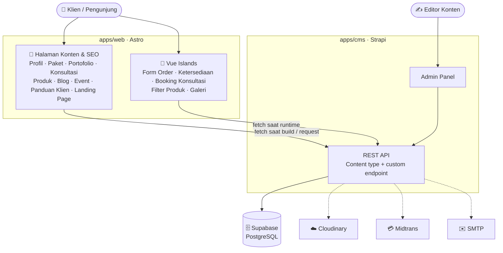
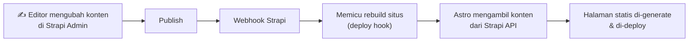
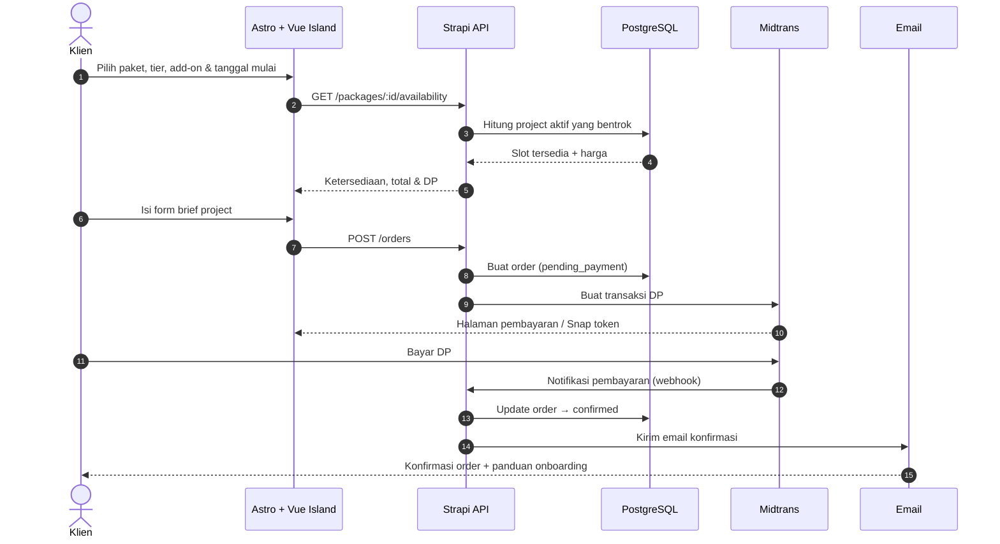

<div align="center">

# 🧑‍💻 Service

**Platform jasa pembuatan website berbasis konten yang dibangun di atas Headless CMS.**

Profil agensi · Paket layanan · Pemesanan project · Booking konsultasi · Produk digital · Blog · Event · Panduan klien · Landing page

[🇬🇧 English](README.md) · **🇮🇩 Bahasa Indonesia**

<br/>


[Ringkasan](#-ringkasan) ·
[Fitur](#-fitur) ·
[Arsitektur](#-arsitektur) ·
[Alur](#-alur-utama) ·
[Roadmap](#-roadmap) ·
[Dokumentasi](#-dokumentasi)

</div>

---

## 📖 Ringkasan

**Service** adalah website untuk bisnis jasa pembuatan website saya. Isinya menggabungkan **profil agensi**, **paket layanan** yang bisa **dipesan dan dibayar DP-nya secara online**, **booking konsultasi**, **katalog produk digital**, **blog**, **event**, **panduan klien**, dan **landing page dinamis** dalam satu website.

Project ini dibangun di atas dua ide:

- **Headless CMS**: semua konten disimpan di **Strapi** dan dikelola dari admin panel, jadi editor tidak perlu menyentuh kode frontend.
- **Astro Islands**: halaman dikirim sebagai HTML statis yang cepat dan ramah SEO. **Vue.js** hanya di-hydrate di bagian yang butuh interaksi, seperti form pemesanan, pengecek ketersediaan tanggal mulai, dan filter.

Website ini adalah project terpisah yang ditautkan dari menu **Services** di [portofolio](https://port-tau-azure.vercel.app/) saya.

> [!NOTE]
> 🚧 Project ini masih dalam pengembangan. Saat ini repository baru berisi **dokumentasi dan desain alur**. Implementasi mengikuti [roadmap](#-roadmap).

---

## ✨ Fitur

| Modul | Cakupan |
| --- | --- |
| 🏠 **Profil Agensi** | Home, tentang kami, tim, proses kerja, tech stack, portofolio, testimoni, kontak |
| 📦 **Paket Layanan** | Daftar paket, detail, tier, fitur yang termasuk, contoh hasil kerja, harga, ketersediaan tanggal mulai |
| 🧾 **Pemesanan Project** | Pilih tier, add-on & tanggal mulai, pengecek kapasitas, form brief project, pembayaran DP, konfirmasi, pengelolaan order |
| 💬 **Konsultasi** | Jenis konsultasi, daftar add-on & paket maintenance, jam konsultasi, booking jadwal call |
| 🛍️ **Produk Digital** | Template website, UI kit, starter kit: daftar, kategori, detail, pencarian & filter |
| 📰 **Blog** | Tutorial, studi kasus, tips bisnis & digital, kategori & tag |
| 🎉 **Event** | Webinar, workshop, bootcamp, dan training perusahaan yang akan datang |
| 📘 **Panduan Klien** | Panduan onboarding, proses kerja, kebijakan revisi & refund, SLA, FAQ |
| 🚀 **Landing Page** | Kampanye promo, paket UMKM, diskon musiman, bundling website + maintenance |

---

## 🧰 Tech Stack

| Layer | Teknologi | Peran |
| --- | --- | --- |
| Frontend | **Astro** | Routing, SSG/SSR, layout, SEO |
| Interaktivitas | **Vue.js** (Astro Islands) | Pemesanan, ketersediaan, booking konsultasi, filter |
| Bahasa | **TypeScript** | Type safety di web dan CMS |
| Styling | **Tailwind CSS** | Design system berbasis utility |
| Headless CMS | **Strapi** | Content type, admin panel, REST API, custom endpoint |
| Database | **PostgreSQL** di **Supabase** | Penyimpanan data utama untuk Strapi |

**Integrasi yang direncanakan**

| Layanan | Kegunaan |
| --- | --- |
| Cloudinary | Penyimpanan media & optimasi gambar |
| Midtrans | Payment gateway (DP project) |
| SMTP / Nodemailer | Notifikasi email transaksional |

---

## 🏗️ Arsitektur



| Komponen | Tanggung jawab |
| --- | --- |
| **Astro** | Frontend utama: routing, rendering statis, SSR bila perlu, SEO, layout, performa |
| **Vue.js** | Interaktivitas di sisi klien, hanya dimuat lewat island di tempat yang perlu, jadi sebagian besar halaman mengirim JS seminimal mungkin |
| **Strapi** | Sumber utama semua konten, plus custom endpoint untuk order & booking konsultasi |
| **Supabase PostgreSQL** | Penyimpanan permanen untuk konten dan data transaksi |

➡️ Lihat [docs/id/architecture.md](docs/id/architecture.md) untuk penjelasan lengkapnya.

---

## 🔄 Alur Utama

### Publikasi konten



### Pemesanan project



➡️ Alur lainnya (cek kapasitas, status order, booking konsultasi, rendering, notifikasi) ada di [docs/id/flows.md](docs/id/flows.md).

---

## ⚡ Strategi Rendering

| Halaman | Strategi |
| --- | --- |
| Home · Tentang · Detail Paket · Portofolio · Konsultasi | `SSG` |
| Blog · Detail Blog · Event · Panduan Klien · Landing Page | `SSG` |
| Daftar Paket · Katalog Produk | `SSG` / `SSR` |
| Pemesanan · Ketersediaan · Booking Konsultasi | `Vue Island` + API dinamis |

---

## 📁 Struktur Project

<details>
<summary><b>Rencana struktur monorepo</b></summary>

```text
service/
├── apps/
│   ├── web/                    # Frontend Astro
│   │   ├── src/
│   │   │   ├── components/
│   │   │   │   ├── astro/      # Komponen statis
│   │   │   │   └── vue/        # Island interaktif
│   │   │   ├── layouts/
│   │   │   ├── pages/
│   │   │   ├── services/       # Client API Strapi
│   │   │   ├── utils/
│   │   │   └── types/
│   │   └── astro.config.mjs
│   │
│   └── cms/                    # Headless CMS Strapi
│       ├── config/
│       ├── src/
│       │   ├── api/            # Content type & custom endpoint
│       │   ├── components/     # Komponen Strapi yang reusable
│       │   └── extensions/
│       └── package.json
│
├── packages/
│   └── shared/                 # Type & utilitas bersama
│
├── docs/                       # Dokumentasi project
├── .env.example
├── package.json
└── README.md
```

</details>

---

## 🗺️ Roadmap

- [ ] **Fase 1: Fondasi.** Astro, integrasi Vue, TypeScript, Tailwind CSS, Strapi, PostgreSQL, environment variable
- [ ] **Fase 2: CMS.** Content model untuk paket, fitur, project portofolio, konsultasi, add-on, produk digital, artikel blog, event, testimoni, landing page, panduan klien
- [ ] **Fase 3: Website Inti.** Home, profil agensi, paket, portofolio, konsultasi, produk digital, blog, event, panduan klien
- [ ] **Fase 4: Fitur Interaktif.** Pemesanan project, pengecek kapasitas, pemilih tanggal mulai, filter produk, booking konsultasi, galeri
- [ ] **Fase 5: Integrasi.** Cloudinary, notifikasi email, payment gateway, analytics
- [ ] **Fase 6: Optimasi.** Technical SEO, sitemap, structured data, Open Graph, optimasi gambar, aksesibilitas, audit Lighthouse

<details>
<summary><b>Pengembangan ke depan</b></summary>

- Autentikasi pengguna & client portal (progres project, deliverable, invoice)
- Riwayat order, request revisi & pembatalan
- Pembayaran pelunasan secara online & kode promo
- Dukungan multi-bahasa & multi-mata uang
- Wishlist untuk produk digital
- Dashboard admin untuk order & booking konsultasi
- Notifikasi email & WhatsApp
- Review dan rating

</details>

---

## 🎯 Tujuan Arsitektur

| Tujuan | Caranya |
| --- | --- |
| ⚡ **Performa** | Astro mengirim HTML statis lebih dulu dan menekan JS di sisi klien seminimal mungkin |
| 🔍 **SEO** | Halaman konten di-pre-render atau di-render di server |
| 🧩 **Interaktivitas** | Vue hanya dimuat di tempat yang butuh interaksi di sisi klien |
| ✍️ **Pengelolaan Konten** | Non-developer bisa mengelola semuanya lewat admin Strapi |
| 📈 **Skalabilitas** | Konten, rendering, dan transaksi dipisah sebagai concern yang berbeda |
| 🛠️ **Maintainability** | TypeScript, komponen reusable, batas modul yang jelas, akses API yang bertipe |

---

## 📚 Dokumentasi

| Dokumen | Isi |
| --- | --- |
| [Arsitektur](docs/id/architecture.md) | Komponen sistem, tanggung jawab, rendering & pengambilan data |
| [Alur](docs/id/flows.md) | Alur publikasi konten, pemesanan, pembayaran, booking konsultasi & notifikasi |
| [Content Model](docs/id/content-model.md) | Content type Strapi dan relasinya |

---

## 📄 Lisensi

Project ini ditujukan untuk **pembelajaran, portofolio, dan pengembangan**.

## 👤 Penulis

**Angga Wika Nugraha**, Frontend / Full-Stack Developer
