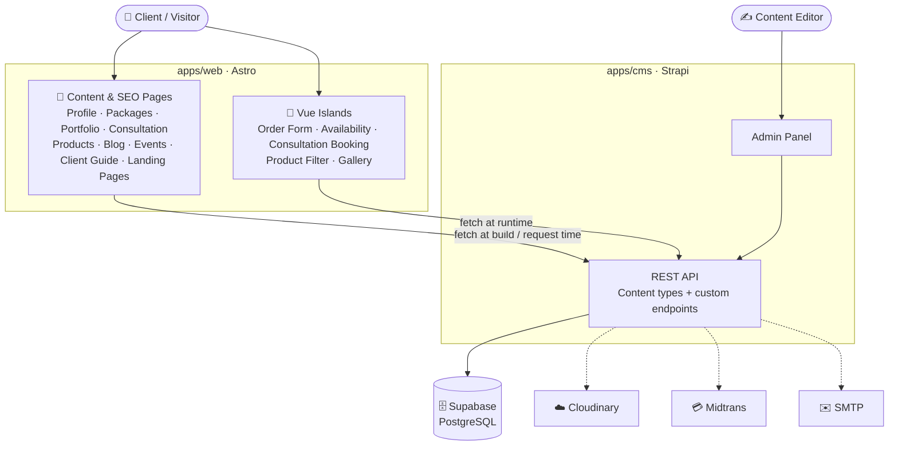
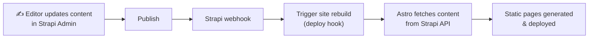
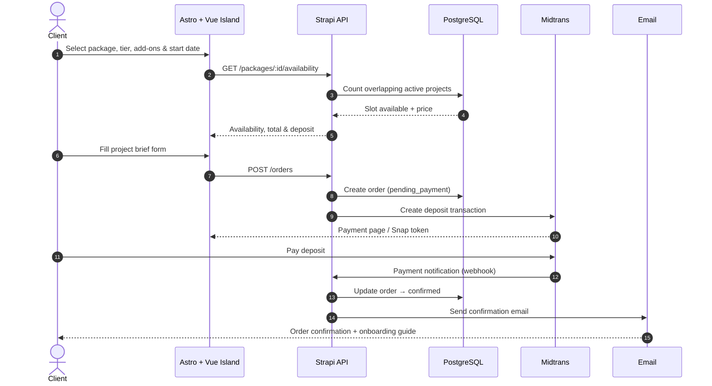

<div align="center">

# 🧑‍💻 Service

**A content-driven web development service platform built on a Headless CMS.**

Agency profile · Service packages · Project ordering · Consultation booking · Digital products · Blog · Events · Client guide · Landing pages

**🇬🇧 English** · [🇮🇩 Bahasa Indonesia](README.id.md)

<br/>


[Overview](#-overview) ·
[Features](#-features) ·
[Architecture](#-architecture) ·
[Flows](#-core-flows) ·
[Roadmap](#-roadmap) ·
[Docs](#-documentation)

</div>

---

## 📖 Overview

**Service** is the website for my web development business. It combines an **agency profile**, **service packages** that clients can **order and pay a deposit for online**, **consultation booking**, a **digital product catalog**, a **blog**, **events**, a **client guide**, and **dynamic landing pages** into one website.

It is built on two ideas:

- **Headless CMS**: all content lives in **Strapi** and is managed from the admin panel, so editors never need to touch frontend code.
- **Astro Islands**: pages ship as fast, SEO-friendly static HTML. **Vue.js** hydrates only the parts that need interaction, such as the order form, the start-date availability checker, and filters.

The site is a standalone project, linked from the **Services** menu of my [portfolio](https://port-tau-azure.vercel.app/).

> [!NOTE]
> 🚧 This project is under active development. This repository currently contains the **documentation and flow design**. Implementation follows the [roadmap](#-roadmap).

---

## ✨ Features

| Module | What it covers |
| --- | --- |
| 🏠 **Agency Profile** | Home, about, team, work process, tech stack, portfolio, testimonials, contact |
| 📦 **Service Packages** | Listing, detail, tiers, included features, sample work, pricing, start-date availability |
| 🧾 **Project Ordering** | Tier, add-on & start-date selection, capacity checker, project brief form, deposit payment, confirmation, management |
| 💬 **Consultation** | Consultation types, add-on & maintenance plan list, consultation hours, call booking |
| 🛍️ **Digital Products** | Website templates, UI kits, starter kits: listing, categories, detail, search & filtering |
| 📰 **Blog** | Tutorials, case studies, business & digital tips, categories & tags |
| 🎉 **Events** | Upcoming webinars, workshops, bootcamps, corporate training |
| 📘 **Client Guide** | Onboarding guide, work process, revision & refund policies, SLA, FAQ |
| 🚀 **Landing Pages** | Promo campaigns, small-business packages, seasonal discounts, website + maintenance bundles |

---

## 🧰 Tech Stack

| Layer | Technology | Role |
| --- | --- | --- |
| Frontend | **Astro** | Routing, SSG/SSR, layouts, SEO |
| Interactivity | **Vue.js** (Astro Islands) | Ordering, availability, consultation booking, filters |
| Language | **TypeScript** | Type safety across web and CMS |
| Styling | **Tailwind CSS** | Utility-first design system |
| Headless CMS | **Strapi** | Content types, admin panel, REST API, custom endpoints |
| Database | **PostgreSQL** on **Supabase** | Primary data store for Strapi |

**Planned integrations**

| Service | Purpose |
| --- | --- |
| Cloudinary | Media storage & image optimization |
| Midtrans | Payment gateway (project deposits) |
| SMTP / Nodemailer | Transactional email notifications |

---

## 🏗️ Architecture



| Component | Responsibility |
| --- | --- |
| **Astro** | Main frontend: routing, static rendering, SSR where needed, SEO, layouts, performance |
| **Vue.js** | Client-side interactivity, loaded only where needed through islands, so most pages ship minimal JS |
| **Strapi** | Single source of truth for content, plus custom endpoints for orders & consultation bookings |
| **Supabase PostgreSQL** | Persistent storage for content and transactional data |

➡️ See [docs/architecture.md](docs/architecture.md) for the full breakdown.

---

## 🔄 Core Flows

### Content publishing



### Project ordering



➡️ More flows (capacity check, order states, consultation booking, rendering, notifications) are in [docs/flows.md](docs/flows.md).

---

## ⚡ Rendering Strategy

| Page | Strategy |
| --- | --- |
| Home · About · Package Detail · Portfolio · Consultation | `SSG` |
| Blog · Blog Detail · Events · Client Guide · Landing Pages | `SSG` |
| Package Listing · Product Catalog | `SSG` / `SSR` |
| Ordering · Availability · Consultation Booking | `Vue Island` + Dynamic API |

---

## 📁 Project Structure

<details>
<summary><b>Planned monorepo layout</b></summary>

```text
service/
├── apps/
│   ├── web/                    # Astro frontend
│   │   ├── src/
│   │   │   ├── components/
│   │   │   │   ├── astro/      # Static components
│   │   │   │   └── vue/        # Interactive islands
│   │   │   ├── layouts/
│   │   │   ├── pages/
│   │   │   ├── services/       # Strapi API clients
│   │   │   ├── utils/
│   │   │   └── types/
│   │   └── astro.config.mjs
│   │
│   └── cms/                    # Strapi headless CMS
│       ├── config/
│       ├── src/
│       │   ├── api/            # Content types & custom endpoints
│       │   ├── components/     # Reusable Strapi components
│       │   └── extensions/
│       └── package.json
│
├── packages/
│   └── shared/                 # Shared types & utilities
│
├── docs/                       # Project documentation
├── .env.example
├── package.json
└── README.md
```

</details>

---

## 🗺️ Roadmap

- [ ] **Phase 1: Foundation.** Astro, Vue integration, TypeScript, Tailwind CSS, Strapi, PostgreSQL, environment variables
- [ ] **Phase 2: CMS.** Content models for packages, features, portfolio projects, consultations, add-ons, digital products, blog posts, events, testimonials, landing pages, client guides
- [ ] **Phase 3: Core Website.** Home, agency profile, packages, portfolio, consultation, digital products, blog, events, client guide
- [ ] **Phase 4: Interactive Features.** Project ordering, capacity checker, start-date picker, product filtering, consultation booking, gallery
- [ ] **Phase 5: Integrations.** Cloudinary, email notifications, payment gateway, analytics
- [ ] **Phase 6: Optimization.** Technical SEO, sitemap, structured data, Open Graph, image optimization, accessibility, Lighthouse audit

<details>
<summary><b>Future improvements</b></summary>

- User authentication & client portal (project progress, deliverables, invoices)
- Order history, revision requests & cancellation
- Online payment for the final balance & promo codes
- Multi-language & multi-currency support
- Wishlist for digital products
- Admin dashboard for orders & consultation bookings
- Email & WhatsApp notifications
- Reviews and ratings

</details>

---

## 🎯 Architecture Goals

| Goal | How |
| --- | --- |
| ⚡ **Performance** | Astro ships static HTML first and keeps client-side JS to a minimum |
| 🔍 **SEO** | Content pages are pre-rendered or server-rendered |
| 🧩 **Interactivity** | Vue loads only where client-side interaction is required |
| ✍️ **Content Management** | Non-developers manage everything through the Strapi admin |
| 📈 **Scalability** | Content, rendering, and transactions are kept as separate concerns |
| 🛠️ **Maintainability** | TypeScript, reusable components, clear module boundaries, typed API access |

---

## 📚 Documentation

| Document | Description |
| --- | --- |
| [Architecture](docs/architecture.md) | System components, responsibilities, rendering & data fetching |
| [Flows](docs/flows.md) | Content publishing, ordering, payment, consultation booking & notification flows |
| [Content Model](docs/content-model.md) | Strapi content types and their relationships |

---

## 📄 License

This project is intended for **learning, portfolio, and development purposes**.

## 👤 Author

**Angga Wika Nugraha**, Frontend / Full-Stack Developer
