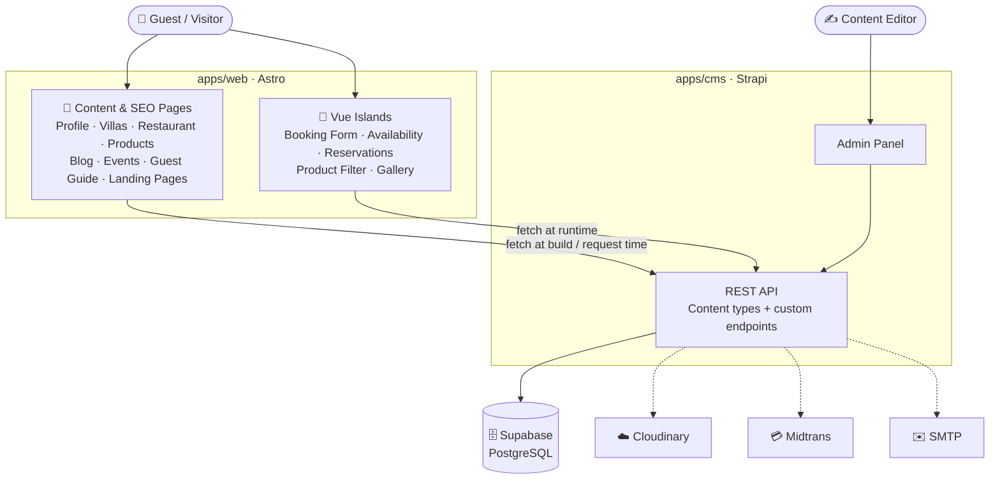
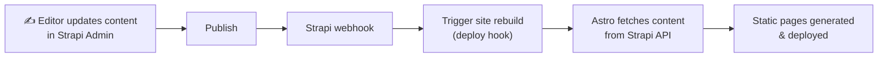
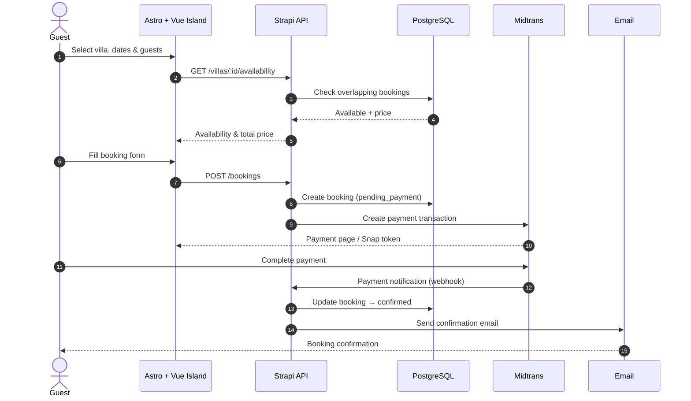

<div align="center">

# 🌴 Luxury Hospitality Platform

**A content-driven luxury villa, restaurant & lifestyle website built on a Headless CMS.**

Company profile · Villa booking · Restaurant reservations · Product catalog · Blog · Events · Guest guide · Landing pages

<br/>


[Overview](#-overview) ·
[Features](#-features) ·
[Architecture](#-architecture) ·
[Flows](#-core-flows) ·
[Roadmap](#-roadmap) ·
[Docs](#-documentation)

</div>

---

## 📖 Overview

The platform combines a luxury villa **company profile**, **villa booking**, **restaurant** information and reservations, a **product catalog**, **blog**, **events**, a **guest guide**, and **dynamic landing pages** into one website.

It is built on two ideas:

- **Headless CMS**: all content lives in **Strapi** and is managed from the admin panel, so editors never need to touch frontend code.
- **Astro Islands**: pages ship as fast, SEO-friendly static HTML. **Vue.js** hydrates only the parts that need interaction, such as booking forms, date pickers, and filters.

> [!NOTE]
> 🚧 This project is under active development. This repository currently contains the **documentation and flow design**. Implementation follows the [roadmap](#-roadmap).

---

## ✨ Features

| Module | What it covers |
| --- | --- |
| 🏠 **Company Profile** | Home, about us, brand story, facilities, gallery, testimonials, contact |
| 🏡 **Luxury Villas** | Listing, detail, rooms, amenities, gallery, pricing, availability |
| 📅 **Booking System** | Date & guest selection, availability checker, booking form, confirmation, management |
| 🍽️ **Restaurant** | Profile, menu, opening hours, gallery, table reservation |
| 🛍️ **Product Catalog** | Listing, categories, detail, search & filtering |
| 📰 **Blog** | Articles, travel guides, culinary content, hospitality stories, categories & tags |
| 🎉 **Events** | Upcoming events, detail, weddings, private dining, corporate events |
| 📘 **Guest Guide** | Check-in / check-out guide, villa policies, guest information, FAQ |
| 🚀 **Landing Pages** | Promo campaigns, seasonal offers, honeymoon packages, villa & event promotions |

---

## 🧰 Tech Stack

| Layer | Technology | Role |
| --- | --- | --- |
| Frontend | **Astro** | Routing, SSG/SSR, layouts, SEO |
| Interactivity | **Vue.js** (Astro Islands) | Booking, availability, reservations, filters |
| Language | **TypeScript** | Type safety across web and CMS |
| Styling | **Tailwind CSS** | Utility-first design system |
| Headless CMS | **Strapi** | Content types, admin panel, REST API, custom endpoints |
| Database | **PostgreSQL** on **Supabase** | Primary data store for Strapi |

**Planned integrations**

| Service | Purpose |
| --- | --- |
| Cloudinary | Media storage & image optimization |
| Midtrans | Payment gateway |
| SMTP / Nodemailer | Transactional email notifications |

---

## 🏗️ Architecture



| Component | Responsibility |
| --- | --- |
| **Astro** | Main frontend: routing, static rendering, SSR where needed, SEO, layouts, performance |
| **Vue.js** | Client-side interactivity, loaded only where needed through islands, so most pages ship minimal JS |
| **Strapi** | Single source of truth for content, plus custom endpoints for bookings & reservations |
| **Supabase PostgreSQL** | Persistent storage for content and transactional data |

➡️ See [docs/architecture.md](docs/architecture.md) for the full breakdown.

---

## 🔄 Core Flows

### Content publishing



### Villa booking



➡️ More flows (booking states, restaurant reservation, rendering, notifications) are in [docs/flows.md](docs/flows.md).

---

## ⚡ Rendering Strategy

| Page | Strategy |
| --- | --- |
| Home · About · Villa Detail · Restaurant | `SSG` |
| Blog · Blog Detail · Events · Guest Guide · Landing Pages | `SSG` |
| Villa Listing · Product Catalog | `SSG` / `SSR` |
| Booking · Availability · Reservations | `Vue Island` + Dynamic API |

---

## 📁 Project Structure

<details>
<summary><b>Planned monorepo layout</b></summary>

```text
luxury-hospitality-platform/
├── apps/
│   ├── web/                    # Astro frontend
│   │   ├── src/
│   │   │   ├── components/
│   │   │   │   ├── astro/      # Static components
│   │   │   │   └── vue/        # Interactive islands
│   │   │   ├── layouts/
│   │   │   ├── pages/
│   │   │   ├── services/       # Strapi API clients
│   │   │   ├── utils/
│   │   │   └── types/
│   │   └── astro.config.mjs
│   │
│   └── cms/                    # Strapi headless CMS
│       ├── config/
│       ├── src/
│       │   ├── api/            # Content types & custom endpoints
│       │   ├── components/     # Reusable Strapi components
│       │   └── extensions/
│       └── package.json
│
├── packages/
│   └── shared/                 # Shared types & utilities
│
├── docs/                       # Project documentation
├── .env.example
├── package.json
└── README.md
```

</details>

---

## 🗺️ Roadmap

- [ ] **Phase 1: Foundation.** Astro, Vue integration, TypeScript, Tailwind CSS, Strapi, PostgreSQL, environment variables
- [ ] **Phase 2: CMS.** Content models for villas, facilities, restaurants, menus, products, blog posts, events, testimonials, landing pages, guest guides
- [ ] **Phase 3: Core Website.** Home, company profile, villas, restaurant, product catalog, blog, events, guest guide
- [ ] **Phase 4: Interactive Features.** Booking, availability checker, date picker, product filtering, restaurant reservation, gallery
- [ ] **Phase 5: Integrations.** Cloudinary, email notifications, payment gateway, analytics
- [ ] **Phase 6: Optimization.** Technical SEO, sitemap, structured data, Open Graph, image optimization, accessibility, Lighthouse audit

<details>
<summary><b>Future improvements</b></summary>

- User authentication & customer dashboard
- Booking history & cancellation
- Online payment & promo codes
- Multi-language & multi-currency support
- Wishlist
- Admin booking & restaurant reservation dashboard
- Email & WhatsApp notifications
- Reviews and ratings

</details>

---

## 🎯 Architecture Goals

| Goal | How |
| --- | --- |
| ⚡ **Performance** | Astro ships static HTML first and keeps client-side JS to a minimum |
| 🔍 **SEO** | Content pages are pre-rendered or server-rendered |
| 🧩 **Interactivity** | Vue loads only where client-side interaction is required |
| ✍️ **Content Management** | Non-developers manage everything through the Strapi admin |
| 📈 **Scalability** | Content, rendering, and transactions are kept as separate concerns |
| 🛠️ **Maintainability** | TypeScript, reusable components, clear module boundaries, typed API access |

---

## 📚 Documentation

| Document | Description |
| --- | --- |
| [Architecture](docs/architecture.md) | System components, responsibilities, rendering & data fetching |
| [Flows](docs/flows.md) | Content publishing, booking, payment, reservation & notification flows |
| [Content Model](docs/content-model.md) | Strapi content types and their relationships |

---

## 📄 License

This project is intended for **learning, portfolio, and development purposes**.

## 👤 Author

**Angga Wika Nugraha**, Frontend / Full-Stack Developer
