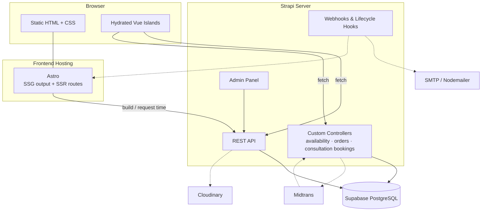
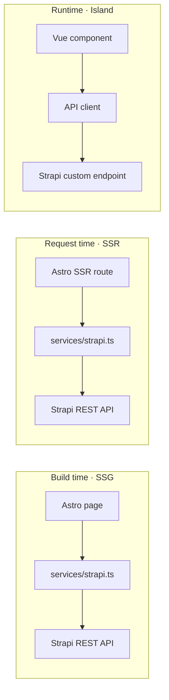

# 🏗️ Architecture

[← Back to README](../README.md) · [🇮🇩 Bahasa Indonesia](id/architecture.md)

The platform combines **Headless CMS Architecture** with **Astro Islands Architecture**. Content, rendering, and transactional logic are separated into clear layers.

## Table of Contents

- [System Overview](#system-overview)
- [Components](#components)
- [Rendering Strategy](#rendering-strategy)
- [Data Fetching](#data-fetching)
- [API Surface](#api-surface)
- [Environment Variables](#environment-variables)

---

## System Overview

---

## Components

### Astro: `apps/web`

The main frontend framework. It handles:

- Routing
- Static site generation (SSG)
- Server-side rendering (SSR) when required
- SEO: meta tags, Open Graph, sitemap, structured data
- Layouts and content-driven pages
- Performance optimization: image optimization, zero-JS by default

### Vue.js: Astro Islands

Vue components are hydrated only where client-side interaction is required:

| Island | Hydration directive | Why |
| --- | --- | --- |
| Order form | `client:load` | Needed immediately on the order page |
| Start-date picker / availability checker | `client:load` | Core interaction on package detail |
| Product filter | `client:idle` | Can wait until the main thread is free |
| Consultation booking | `client:visible` | Usually below the fold |
| Interactive gallery | `client:visible` | Only hydrate when scrolled into view |

The rest of the website ships **static HTML with little or no JavaScript**.

### Strapi: `apps/cms`

The headless CMS and backend API. It provides:

- **Content types** for packages, features, portfolio projects, consultations, add-ons, digital products, blog posts, categories, events, landing pages, testimonials, FAQs, client guides
- **Admin panel** so editors can manage content without changing frontend code
- **Custom endpoints** for transactional logic such as availability, orders, and consultation bookings
- **Webhooks** that trigger frontend rebuilds when content is published
- **Lifecycle hooks** that send email notifications

See [content-model.md](content-model.md) for the full data model.

### Supabase PostgreSQL

The primary database for Strapi content and application data such as orders and consultation bookings.

---

## Rendering Strategy

| Page | Strategy | Notes |
| --- | --- | --- |
| Home | SSG | Rebuilt on content publish |
| About | SSG | |
| Package Listing | SSG / SSR | SSR if listing depends on live filters |
| Package Detail | SSG | Availability loaded by a Vue island |
| Portfolio / Portfolio Detail | SSG | `getStaticPaths` from Strapi slugs |
| Blog / Blog Detail | SSG | `getStaticPaths` from Strapi slugs |
| Consultation | SSG | Booking form is a Vue island |
| Product Catalog | SSG / SSR | SSR for search & filter query params |
| Events | SSG | |
| Client Guide | SSG | |
| Landing Pages | SSG | Built from Strapi dynamic zones |
| Order | Vue Island | Dynamic API |
| Availability | Vue Island | Dynamic API, never cached |

---

## Data Fetching

Guidelines:

- All Strapi calls go through a typed service layer in `apps/web/src/services/`.
- Shared response types live in `packages/shared/` so the web app and the CMS use the same types.
- Public content is read with a **read-only API token**. Write operations such as orders and consultation bookings go through **custom endpoints** that validate input on the server.

---

## API Surface

> Planned. Endpoints may change during implementation.

| Method | Endpoint | Description |
| --- | --- | --- |
| `GET` | `/api/packages` | List service packages |
| `GET` | `/api/packages/:slug` | Package detail with tiers & features |
| `GET` | `/api/packages/:id/availability?tier=&startDate=&addOns=` | Check capacity, end date, price & deposit |
| `POST` | `/api/orders` | Create an order (`pending_payment`) |
| `GET` | `/api/orders/:code` | Look up an order by order code |
| `POST` | `/api/payments/notification` | Midtrans payment webhook |
| `GET` | `/api/portfolio-projects` | Portfolio projects |
| `GET` | `/api/consultations/:slug` | Consultation profile, hours & add-on list |
| `POST` | `/api/consultation-bookings` | Create a consultation booking |
| `GET` | `/api/products` | Digital products with filters |
| `GET` | `/api/posts` | Blog posts |
| `GET` | `/api/events` | Events |
| `GET` | `/api/landing-pages/:slug` | Landing page with dynamic zone blocks |

---

## Environment Variables

> Planned. The final list will be in `.env.example`.

**`apps/web`**

| Variable | Description |
| --- | --- |
| `PUBLIC_STRAPI_URL` | Public Strapi base URL |
| `STRAPI_API_TOKEN` | Read-only token used at build time |
| `PUBLIC_MIDTRANS_CLIENT_KEY` | Midtrans client key for Snap |

**`apps/cms`**

| Variable | Description |
| --- | --- |
| `DATABASE_URL` | Supabase PostgreSQL connection string |
| `APP_KEYS` / `API_TOKEN_SALT` / `ADMIN_JWT_SECRET` / `JWT_SECRET` | Strapi secrets |
| `CLOUDINARY_NAME` / `CLOUDINARY_KEY` / `CLOUDINARY_SECRET` | Media upload provider |
| `MIDTRANS_SERVER_KEY` / `MIDTRANS_IS_PRODUCTION` | Payment gateway |
| `SMTP_HOST` / `SMTP_PORT` / `SMTP_USER` / `SMTP_PASS` | Email notifications |
| `DEPLOY_HOOK_URL` | Frontend rebuild hook triggered on publish |
