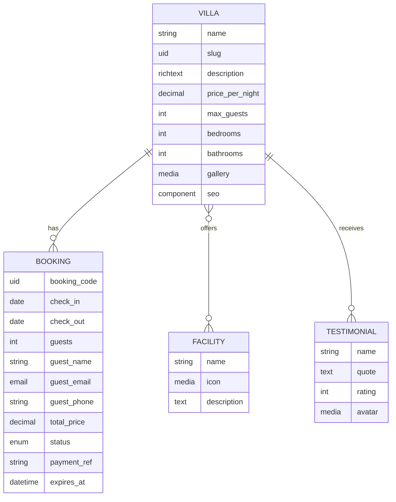
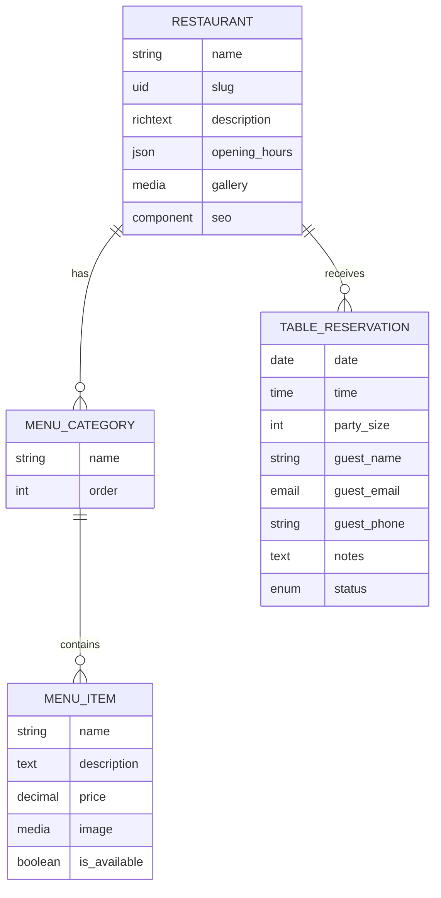
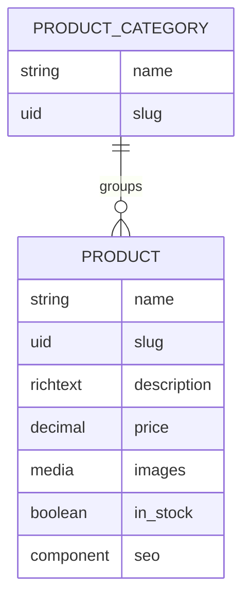
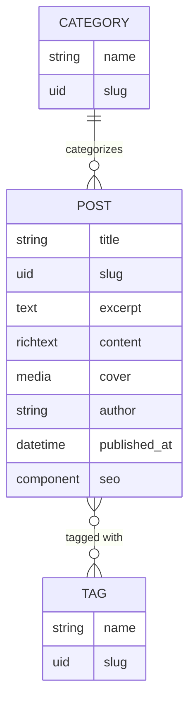
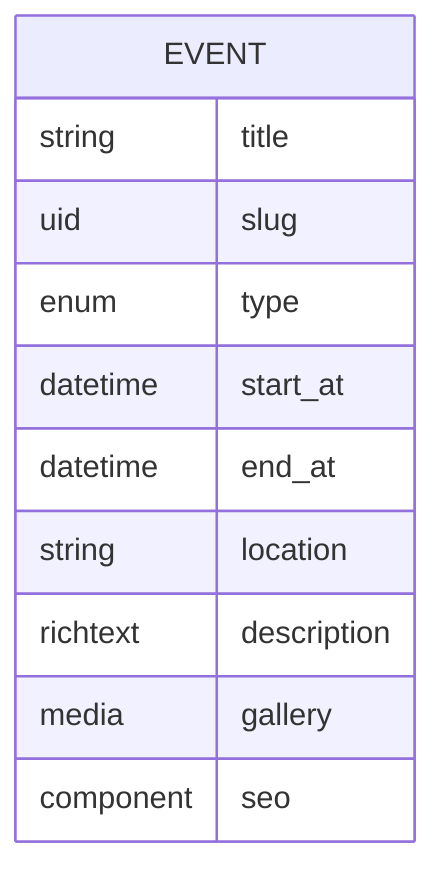
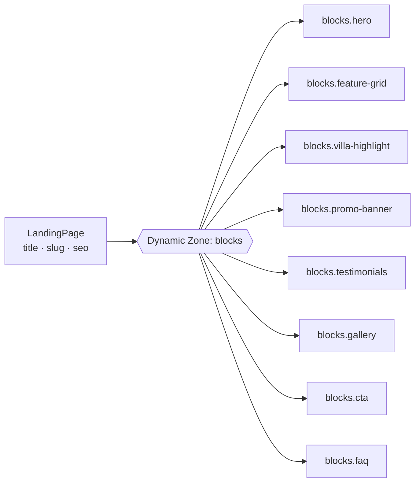

# 🗂️ Content Model

[← Back to README](../README.md)

These are the proposed **Strapi content types** and how they relate to each other.

> [!NOTE]
> This is a design draft. Field names and relations may change during Phase 2 (CMS).

## Table of Contents

- [Overview](#overview)
- [Villas & Booking](#villas--booking)
- [Restaurant](#restaurant)
- [Products](#products)
- [Blog](#blog)
- [Events](#events)
- [Landing Pages](#landing-pages)
- [Global & Single Types](#global--single-types)

---

## Overview

| Group | Collection Types | Single Types |
| --- | --- | --- |
| Villas & Booking | `Villa`, `Facility`, `Booking` | — |
| Restaurant | `Restaurant`, `MenuCategory`, `MenuItem`, `TableReservation` | — |
| Products | `Product`, `ProductCategory` | — |
| Blog | `Post`, `Category`, `Tag` | — |
| Events | `Event` | — |
| Marketing | `LandingPage`, `Testimonial` | — |
| Guest Guide | `GuestGuide`, `Faq` | — |
| Global | — | `Homepage`, `About`, `SiteSetting` |

---

## Villas & Booking

`Booking.status` is one of `pending_payment`, `confirmed`, `checked_in`, `completed`, `cancelled`, or `expired`. See [Booking Status Lifecycle](flows.md#6-booking-status-lifecycle).

---

## Restaurant

`TableReservation.status` is one of `pending`, `confirmed`, `declined`, `cancelled`, `completed`, or `no_show`.

---

## Products

---

## Blog

Example categories are *Travel Guides*, *Culinary*, and *Hospitality Stories*.

---

## Events

`Event.type` is one of `wedding`, `private_dining`, `corporate`, or `public`.

---

## Landing Pages

Landing pages are built from **dynamic zones**, so editors can compose campaign pages from reusable blocks without writing code.

Each block maps 1:1 to an Astro component in `apps/web/src/components/astro/blocks/`.

Use cases include promotional campaigns, seasonal offers, honeymoon packages, villa promotions, and event campaigns.

---

## Global & Single Types

| Type | Fields |
| --- | --- |
| `Homepage` | Hero, featured villas, highlights, testimonials, SEO |
| `About` | Brand story, facilities, gallery, SEO |
| `SiteSetting` | Site name, logo, contact info, social links, default SEO |
| `GuestGuide` | Title, slug, category (`check-in`, `check-out`, `policy`, `info`), content |
| `Faq` | Question, answer, category, order |

**Shared components**

| Component | Fields |
| --- | --- |
| `shared.seo` | `meta_title`, `meta_description`, `og_image`, `canonical_url`, `no_index` |
| `shared.contact` | `phone`, `whatsapp`, `email`, `address`, `map_url` |
