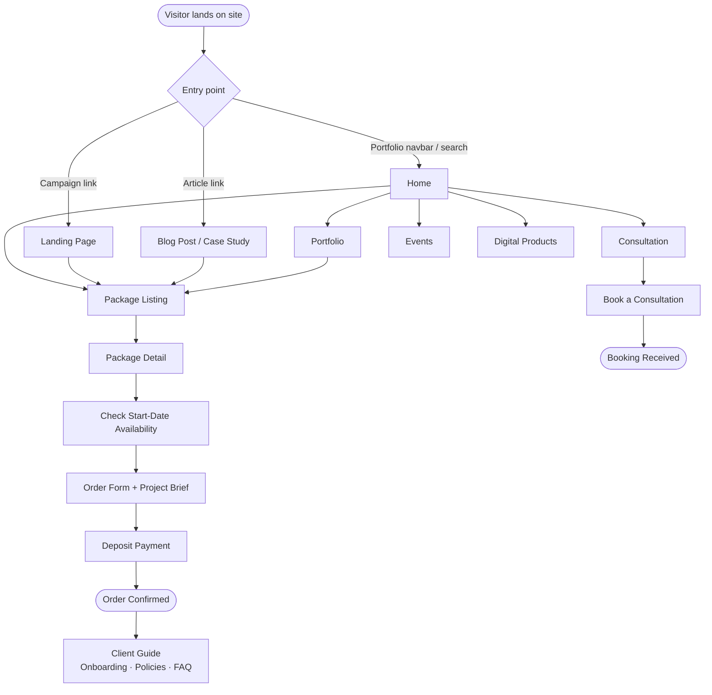
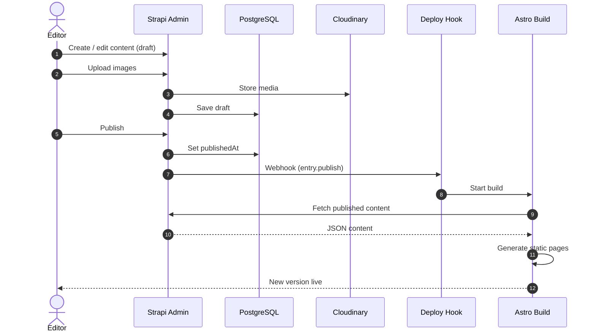
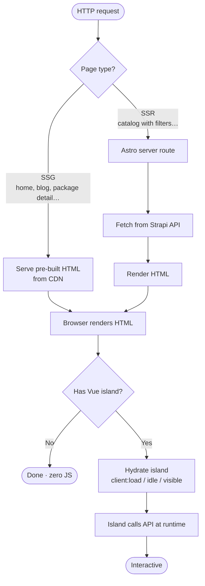
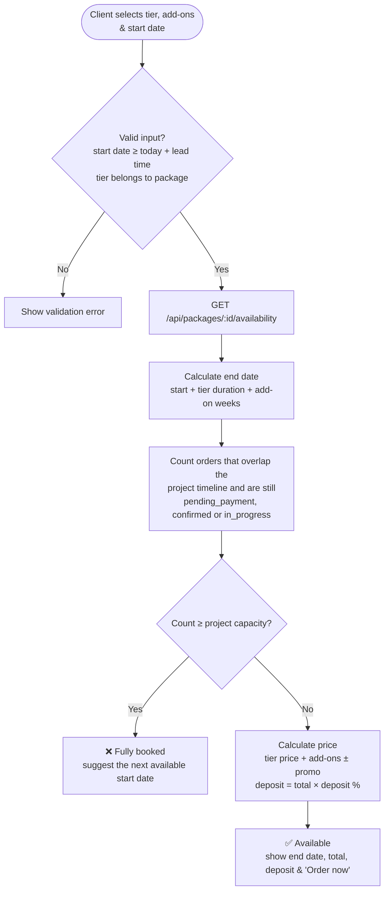
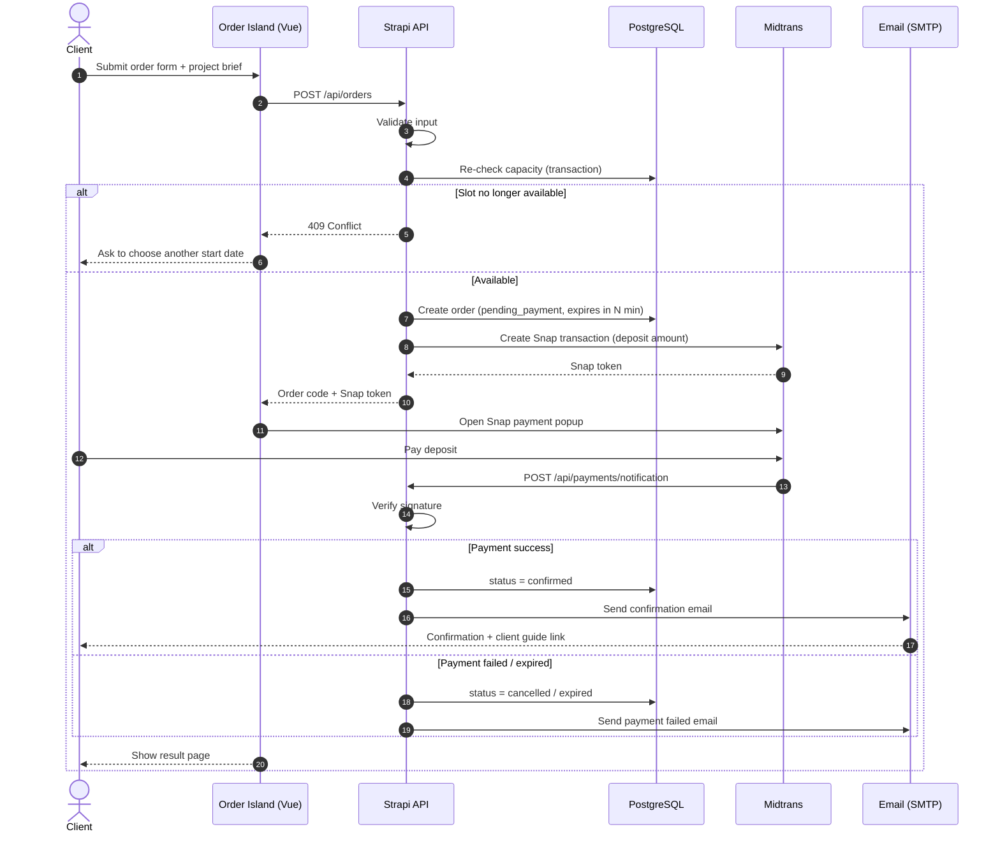
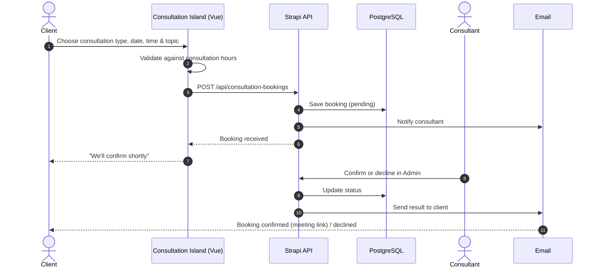
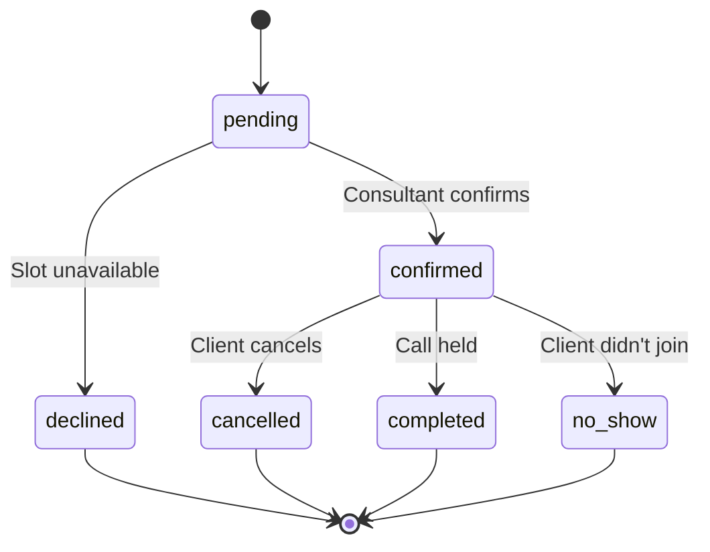
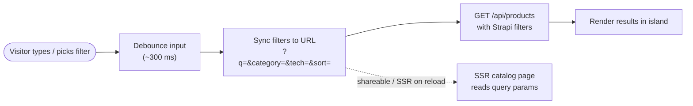

# 🔄 Flows

[← Back to README](../README.md) · [🇮🇩 Bahasa Indonesia](id/flows.md)

This page describes the main user and system flows of the platform.

## Table of Contents

1. [Visitor Journey](#1-visitor-journey)
2. [Content Publishing](#2-content-publishing)
3. [Page Request & Rendering](#3-page-request--rendering)
4. [Project Availability Check](#4-project-availability-check)
5. [Project Ordering & Payment](#5-project-ordering--payment)
6. [Order Status Lifecycle](#6-order-status-lifecycle)
7. [Consultation Booking](#7-consultation-booking)
8. [Product Search & Filter](#8-product-search--filter)
9. [Email Notifications](#9-email-notifications)

---

## 1. Visitor Journey

How a potential client moves through the website.



---

## 2. Content Publishing

Editors manage content in Strapi. Publishing triggers a rebuild so the static pages stay up to date.



> [!TIP]
> Content that must always be live, such as project slots and prices at order time, is **never** taken from the static build. It is always fetched at runtime.

---

## 3. Page Request & Rendering

How a request is served depending on the page type.



---

## 4. Project Availability Check

Runs inside the availability **Vue island** on the package detail page. The team can only run a limited number of projects at the same time, so a start date is available only while there is free capacity for the whole project timeline.



**Capacity rule.** An existing order uses a slot in the requested timeline when:

```text
existing.start_date  <  requested.end_date
AND
existing.end_date    >  requested.start_date
AND
existing.status IN ('pending_payment', 'confirmed', 'in_progress')
```

The start date is available when `COUNT(overlapping orders) < SiteSetting.project_capacity`.

---

## 5. Project Ordering & Payment



**Key rules**

- Capacity is checked **twice**: once for display, and again inside a DB transaction when the order is created. This prevents overbooking the team.
- Pending orders **expire** if the deposit is not paid within the payment window, which frees up the slot.
- The price and deposit are always **calculated on the server**. The client never sends a price that is trusted.
- Payment webhooks are **signature-verified** before the order status changes.
- The remaining balance is invoiced at handover. Paying it online is a [future improvement](../README.md#-roadmap).

---

## 6. Order Status Lifecycle


| Status | Uses capacity? | Description |
| --- | --- | --- |
| `pending_payment` | ✅ | Waiting for the deposit within the payment window |
| `confirmed` | ✅ | Deposit paid, waiting for kickoff |
| `in_progress` | ✅ | Project is being built |
| `completed` | ❌ | Project handed over |
| `cancelled` | ❌ | Cancelled by client, admin, or failed payment |
| `expired` | ❌ | Deposit not paid in time |

---

## 7. Consultation Booking

Consultations don't need online payment. The consultant confirms them from the Strapi admin and sends the meeting link.





---

## 8. Product Search & Filter



Filters are stored in the URL, so filtered results can be shared, bookmarked, and indexed.

---

## 9. Email Notifications

Sent from Strapi lifecycle hooks or controllers through SMTP / Nodemailer.

| Trigger | Recipient | Email |
| --- | --- | --- |
| Order created | Client | Order received + deposit payment instructions |
| Payment success | Client | Order confirmation + client guide link |
| Payment success | Admin | New confirmed order |
| Payment failed / expired | Client | Payment failed / order expired |
| Order cancelled | Client & Admin | Cancellation notice |
| Consultation booking created | Consultant | New consultation booking |
| Consultation confirmed / declined | Client | Booking result + meeting link |
| H-1 before kickoff | Client | Kickoff reminder + preparation checklist *(future)* |
