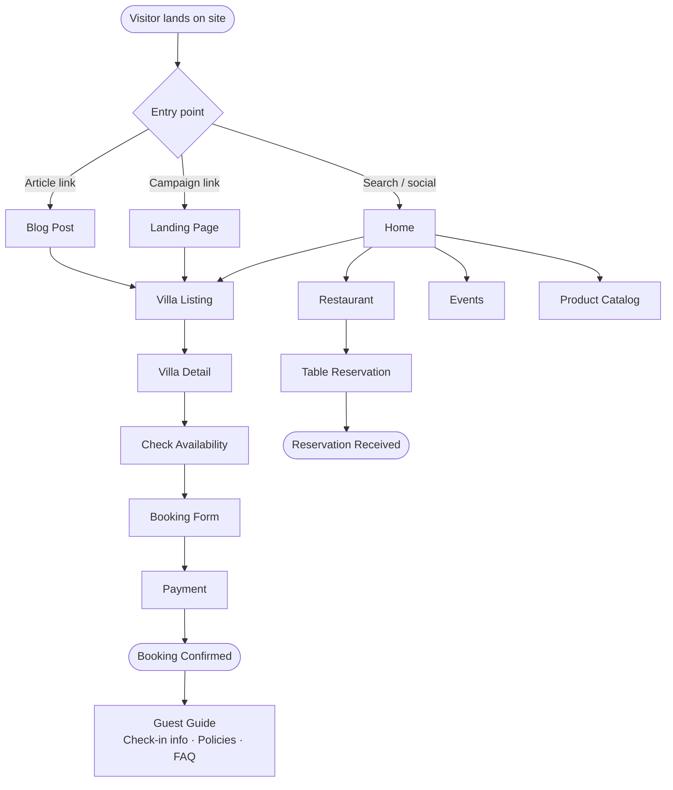
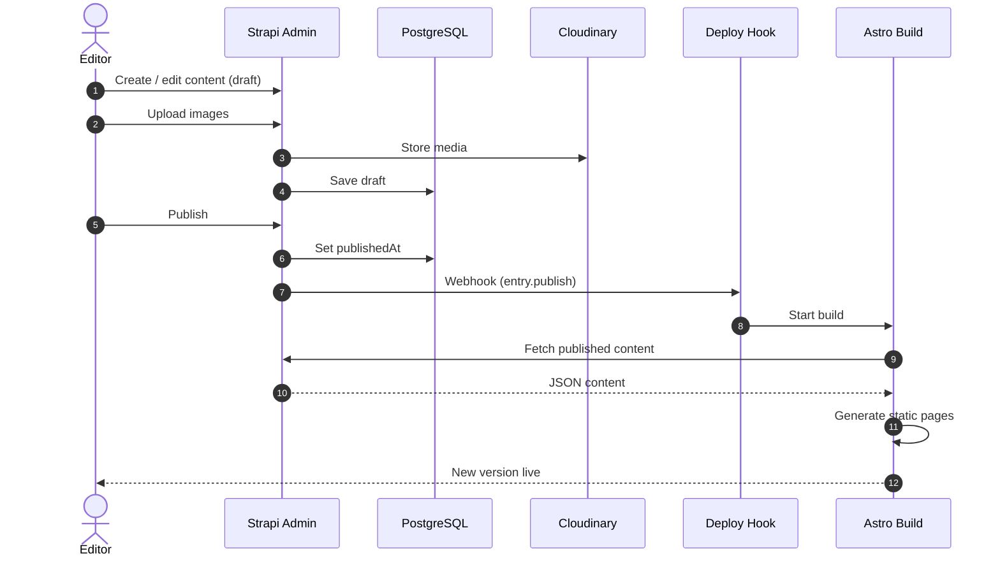
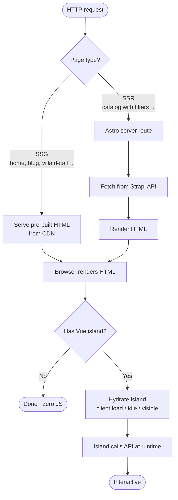
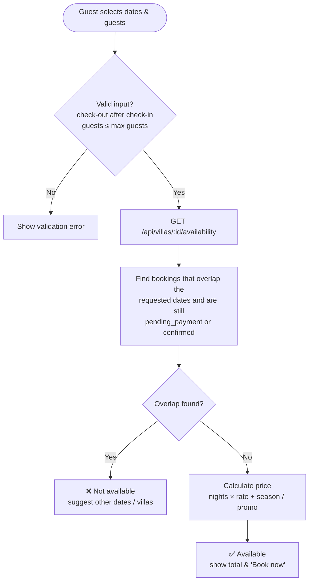
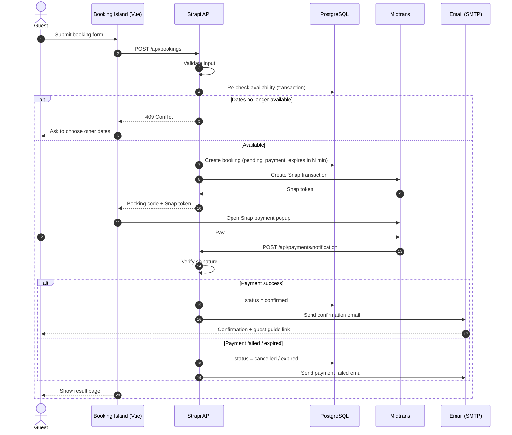
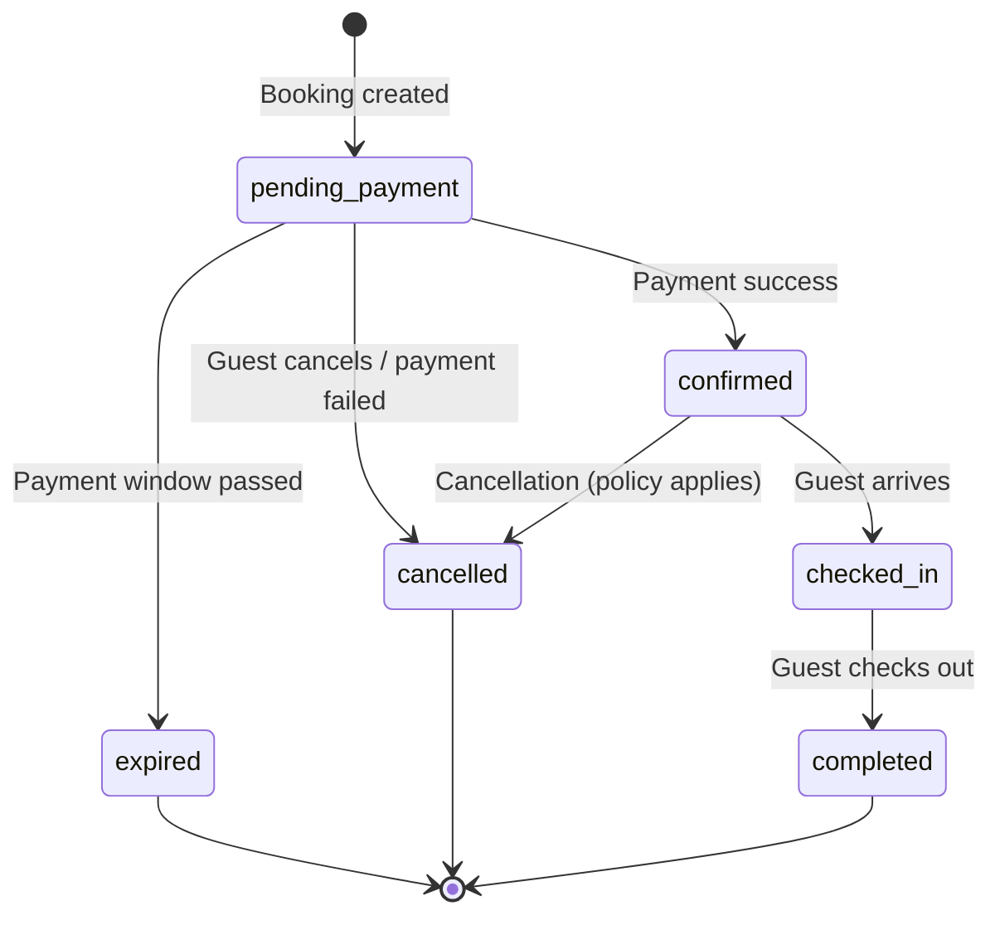
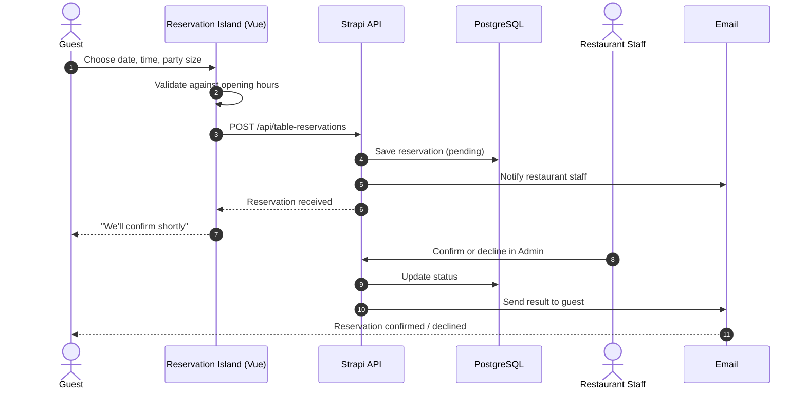
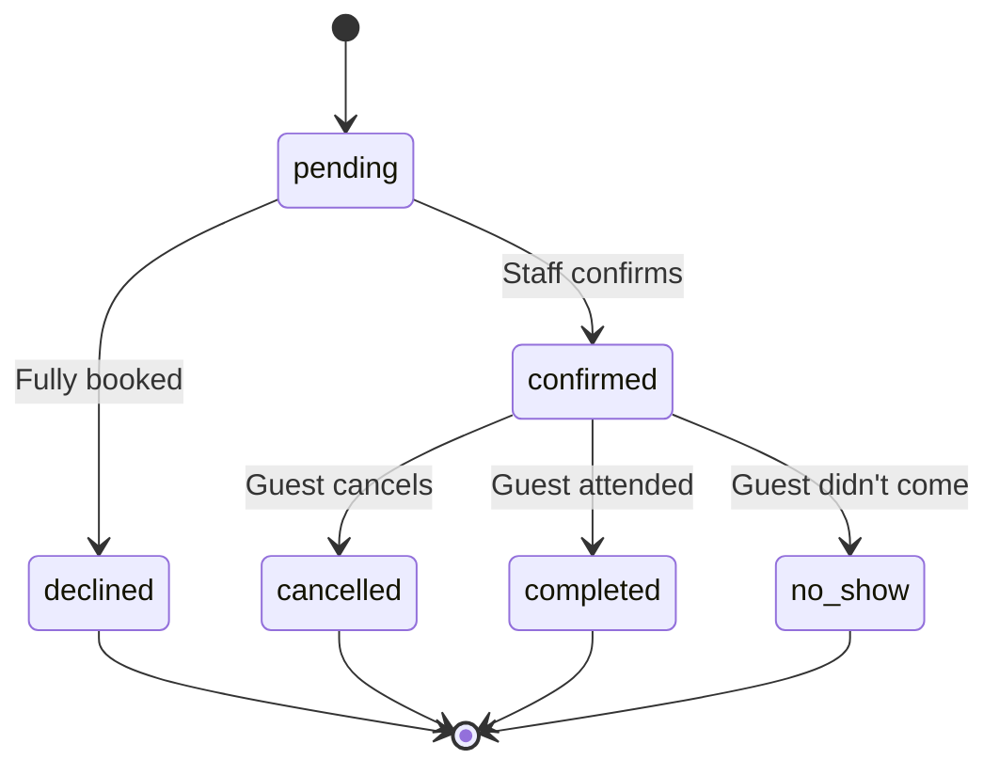
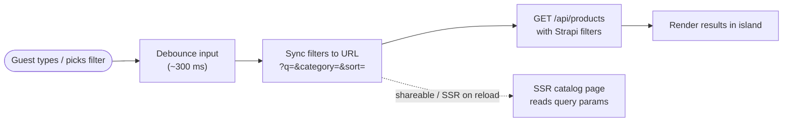

# 🔄 Flows

[← Back to README](../README.md)

This page describes the main user and system flows of the platform.

## Table of Contents

1. [Visitor Journey](#1-visitor-journey)
2. [Content Publishing](#2-content-publishing)
3. [Page Request & Rendering](#3-page-request--rendering)
4. [Villa Availability Check](#4-villa-availability-check)
5. [Villa Booking & Payment](#5-villa-booking--payment)
6. [Booking Status Lifecycle](#6-booking-status-lifecycle)
7. [Restaurant Table Reservation](#7-restaurant-table-reservation)
8. [Product Search & Filter](#8-product-search--filter)
9. [Email Notifications](#9-email-notifications)

---

## 1. Visitor Journey

How a guest moves through the website.



---

## 2. Content Publishing

Editors manage content in Strapi. Publishing triggers a rebuild so the static pages stay up to date.



> [!TIP]
> Content that must always be live, such as availability and prices at booking time, is **never** taken from the static build. It is always fetched at runtime.

---

## 3. Page Request & Rendering

How a request is served depending on the page type.



---

## 4. Villa Availability Check

Runs inside the availability **Vue island** on the villa detail page.



**Overlap rule.** An existing booking blocks the requested range when:

```text
existing.check_in  <  requested.check_out
AND
existing.check_out >  requested.check_in
AND
existing.status IN ('pending_payment', 'confirmed')
```

---

## 5. Villa Booking & Payment



**Key rules**

- Availability is checked **twice**: once for display, and again inside a DB transaction when the booking is created. This prevents double bookings.
- Pending bookings **expire** if they are not paid within the payment window, which frees up the dates.
- The price is always **calculated on the server**. The client never sends a price that is trusted.
- Payment webhooks are **signature-verified** before the booking status changes.

---

## 6. Booking Status Lifecycle



| Status | Blocks dates? | Description |
| --- | --- | --- |
| `pending_payment` | ✅ | Waiting for payment within the payment window |
| `confirmed` | ✅ | Paid and confirmed |
| `checked_in` | ✅ | Guest is staying at the villa |
| `completed` | ❌ | Stay finished |
| `cancelled` | ❌ | Cancelled by guest, admin, or failed payment |
| `expired` | ❌ | Not paid in time |

---

## 7. Restaurant Table Reservation

Reservations don't need online payment. Staff confirm them from the Strapi admin.





---

## 8. Product Search & Filter



Filters are stored in the URL, so filtered results can be shared, bookmarked, and indexed.

---

## 9. Email Notifications

Sent from Strapi lifecycle hooks or controllers through SMTP / Nodemailer.

| Trigger | Recipient | Email |
| --- | --- | --- |
| Booking created | Guest | Booking received + payment instructions |
| Payment success | Guest | Booking confirmation + guest guide link |
| Payment success | Admin | New confirmed booking |
| Payment failed / expired | Guest | Payment failed / booking expired |
| Booking cancelled | Guest & Admin | Cancellation notice |
| Reservation created | Restaurant staff | New table reservation |
| Reservation confirmed / declined | Guest | Reservation result |
| H-1 before check-in | Guest | Check-in reminder + directions *(future)* |
