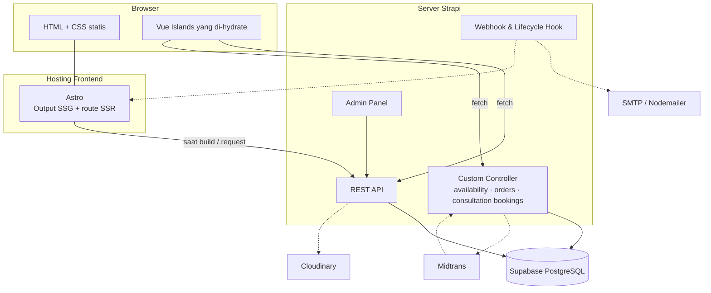
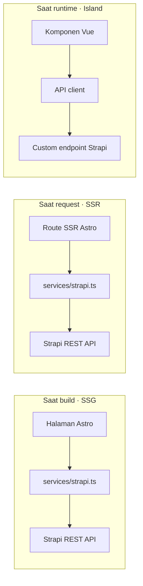

# 🏗️ Arsitektur

[← Kembali ke README](../../README.id.md) · [🇬🇧 English](../architecture.md)

Platform ini menggabungkan **Headless CMS Architecture** dengan **Astro Islands Architecture**. Konten, rendering, dan logika transaksi dipisah ke dalam layer yang jelas.

## Daftar Isi

- [Gambaran Sistem](#gambaran-sistem)
- [Komponen](#komponen)
- [Strategi Rendering](#strategi-rendering)
- [Pengambilan Data](#pengambilan-data)
- [Daftar API](#daftar-api)
- [Environment Variables](#environment-variables)

---

## Gambaran Sistem

---

## Komponen

### Astro: `apps/web`

Framework frontend utama. Tugasnya:

- Routing
- Static site generation (SSG)
- Server-side rendering (SSR) bila dibutuhkan
- SEO: meta tag, Open Graph, sitemap, structured data
- Layout dan halaman berbasis konten
- Optimasi performa: optimasi gambar, zero-JS secara default

### Vue.js: Astro Islands

Komponen Vue hanya di-hydrate di tempat yang butuh interaksi di sisi klien:

| Island | Directive hydration | Alasan |
| --- | --- | --- |
| Form order | `client:load` | Langsung dibutuhkan di halaman order |
| Pemilih tanggal mulai / pengecek ketersediaan | `client:load` | Interaksi utama di detail paket |
| Filter produk | `client:idle` | Bisa menunggu sampai main thread senggang |
| Booking konsultasi | `client:visible` | Biasanya berada di bawah layar pertama |
| Galeri interaktif | `client:visible` | Hanya di-hydrate saat di-scroll ke area tersebut |

Bagian lain website dikirim sebagai **HTML statis dengan sedikit atau tanpa JavaScript**.

### Strapi: `apps/cms`

Headless CMS sekaligus backend API. Strapi menyediakan:

- **Content type** untuk paket, fitur, project portofolio, konsultasi, add-on, produk digital, artikel blog, kategori, event, landing page, testimoni, FAQ, panduan klien
- **Admin panel** supaya editor bisa mengelola konten tanpa mengubah kode frontend
- **Custom endpoint** untuk logika transaksi seperti ketersediaan, order, dan booking konsultasi
- **Webhook** yang memicu rebuild frontend saat konten di-publish
- **Lifecycle hook** yang mengirim notifikasi email

Lihat [content-model.md](content-model.md) untuk model data lengkapnya.

### Supabase PostgreSQL

Database utama untuk konten Strapi dan data aplikasi seperti order dan booking konsultasi.

---

## Strategi Rendering

| Halaman | Strategi | Catatan |
| --- | --- | --- |
| Home | SSG | Di-rebuild saat konten di-publish |
| Tentang | SSG | |
| Daftar Paket | SSG / SSR | SSR jika daftar bergantung pada filter live |
| Detail Paket | SSG | Ketersediaan dimuat oleh Vue island |
| Portofolio / Detail Portofolio | SSG | `getStaticPaths` dari slug Strapi |
| Blog / Detail Blog | SSG | `getStaticPaths` dari slug Strapi |
| Konsultasi | SSG | Form booking berupa Vue island |
| Katalog Produk | SSG / SSR | SSR untuk query param pencarian & filter |
| Event | SSG | |
| Panduan Klien | SSG | |
| Landing Page | SSG | Disusun dari dynamic zone Strapi |
| Order | Vue Island | API dinamis |
| Ketersediaan | Vue Island | API dinamis, tidak pernah di-cache |

---

## Pengambilan Data

Panduan:

- Semua pemanggilan Strapi melewati service layer bertipe di `apps/web/src/services/`.
- Type response bersama disimpan di `packages/shared/` supaya web app dan CMS memakai type yang sama.
- Konten publik dibaca dengan **API token read-only**. Operasi tulis seperti order dan booking konsultasi lewat **custom endpoint** yang memvalidasi input di server.

---

## Daftar API

> Masih rencana. Endpoint bisa berubah selama implementasi.

| Method | Endpoint | Keterangan |
| --- | --- | --- |
| `GET` | `/api/packages` | Daftar paket layanan |
| `GET` | `/api/packages/:slug` | Detail paket beserta tier & fitur |
| `GET` | `/api/packages/:id/availability?tier=&startDate=&addOns=` | Cek kapasitas, tanggal selesai, harga & DP |
| `POST` | `/api/orders` | Membuat order (`pending_payment`) |
| `GET` | `/api/orders/:code` | Mencari order berdasarkan kode order |
| `POST` | `/api/payments/notification` | Webhook pembayaran Midtrans |
| `GET` | `/api/portfolio-projects` | Project portofolio |
| `GET` | `/api/consultations/:slug` | Profil konsultasi, jam konsultasi & daftar add-on |
| `POST` | `/api/consultation-bookings` | Membuat booking konsultasi |
| `GET` | `/api/products` | Produk digital dengan filter |
| `GET` | `/api/posts` | Artikel blog |
| `GET` | `/api/events` | Event |
| `GET` | `/api/landing-pages/:slug` | Landing page beserta block dynamic zone |

---

## Environment Variables

> Masih rencana. Daftar finalnya ada di `.env.example`.

**`apps/web`**

| Variable | Keterangan |
| --- | --- |
| `PUBLIC_STRAPI_URL` | Base URL publik Strapi |
| `STRAPI_API_TOKEN` | Token read-only yang dipakai saat build |
| `PUBLIC_MIDTRANS_CLIENT_KEY` | Client key Midtrans untuk Snap |

**`apps/cms`**

| Variable | Keterangan |
| --- | --- |
| `DATABASE_URL` | Connection string Supabase PostgreSQL |
| `APP_KEYS` / `API_TOKEN_SALT` / `ADMIN_JWT_SECRET` / `JWT_SECRET` | Secret Strapi |
| `CLOUDINARY_NAME` / `CLOUDINARY_KEY` / `CLOUDINARY_SECRET` | Provider upload media |
| `MIDTRANS_SERVER_KEY` / `MIDTRANS_IS_PRODUCTION` | Payment gateway |
| `SMTP_HOST` / `SMTP_PORT` / `SMTP_USER` / `SMTP_PASS` | Notifikasi email |
| `DEPLOY_HOOK_URL` | Hook rebuild frontend yang dipicu saat publish |
