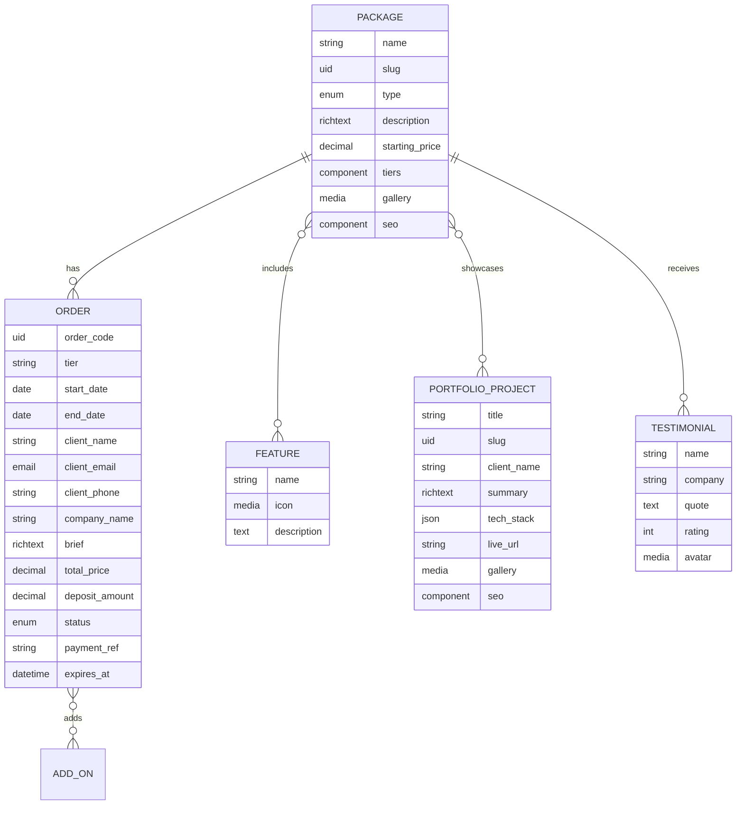
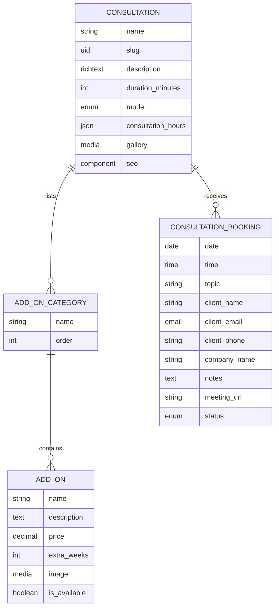
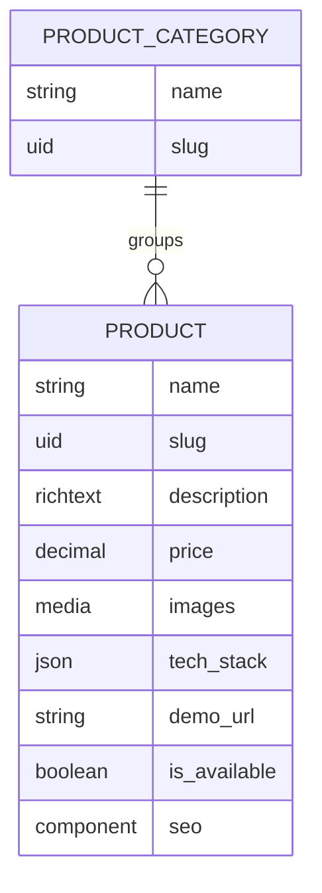
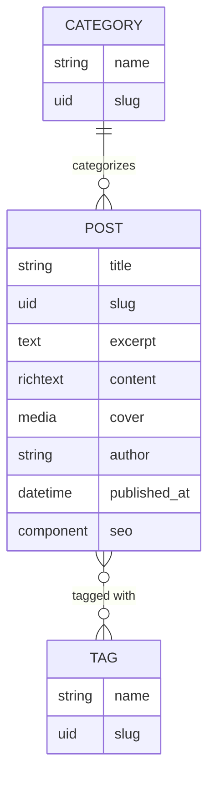
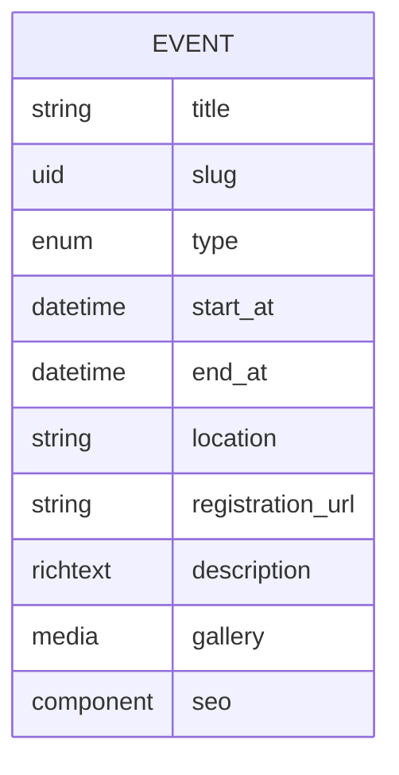
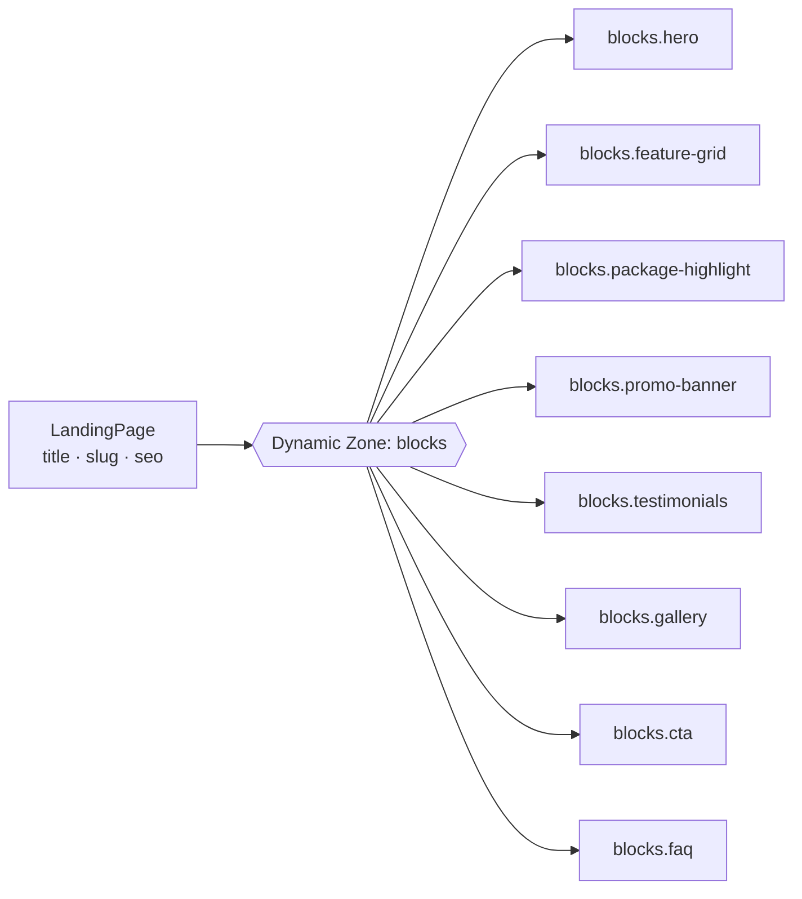

# 🗂️ Content Model

[← Kembali ke README](../../README.id.md) · [🇬🇧 English](../content-model.md)

Berikut **content type Strapi** yang diusulkan beserta relasi antar-content type.

> [!NOTE]
> Ini masih draf desain. Nama field dan relasi bisa berubah selama Fase 2 (CMS).

## Daftar Isi

- [Ringkasan](#ringkasan)
- [Paket & Pemesanan](#paket--pemesanan)
- [Konsultasi](#konsultasi)
- [Produk Digital](#produk-digital)
- [Blog](#blog)
- [Event](#event)
- [Landing Page](#landing-page)
- [Global & Single Types](#global--single-types)

---

## Ringkasan

| Grup | Collection Types | Single Types |
| --- | --- | --- |
| Paket & Pemesanan | `Package`, `Feature`, `PortfolioProject`, `Order` | — |
| Konsultasi | `Consultation`, `AddOnCategory`, `AddOn`, `ConsultationBooking` | — |
| Produk Digital | `Product`, `ProductCategory` | — |
| Blog | `Post`, `Category`, `Tag` | — |
| Event | `Event` | — |
| Marketing | `LandingPage`, `Testimonial` | — |
| Panduan Klien | `ClientGuide`, `Faq` | — |
| Global | — | `Homepage`, `About`, `SiteSetting` |

---

## Paket & Pemesanan

`Package.type` berisi salah satu dari `landing_page`, `company_profile`, `ecommerce`, atau `web_app`.

`Package.tiers` adalah komponen `package.tier` yang repeatable (misalnya *Basic*, *Pro*, *Enterprise*) dengan field `name`, `price`, `duration_weeks`, `revision_count`, dan `features`.

`Order.status` berisi salah satu dari `pending_payment`, `confirmed`, `in_progress`, `completed`, `cancelled`, atau `expired`. Lihat [Siklus Status Order](flows.md#6-siklus-status-order).

---

## Konsultasi

Contoh jenis konsultasi: *Discovery Call*, *Technical Audit*, dan *Website Review*. `Consultation.mode` berisi `online` atau `offline`.

Add-on dikelompokkan ke dalam kategori seperti *Fitur Tambahan*, *Paket Maintenance*, dan *SEO & Konten*. Add-on yang sama bisa ditambahkan ke `Order`, dan field `extra_weeks` memperpanjang timeline project.

`ConsultationBooking.status` berisi salah satu dari `pending`, `confirmed`, `declined`, `cancelled`, `completed`, atau `no_show`.

---

## Produk Digital

Contoh kategori: *Template Website*, *UI Kit*, dan *Starter Kit*.

---

## Blog

Contoh kategori: *Tutorial*, *Studi Kasus*, dan *Bisnis & Digital*.

---

## Event

`Event.type` berisi salah satu dari `webinar`, `workshop`, `bootcamp`, atau `corporate_training`.

---

## Landing Page

Landing page disusun dari **dynamic zone**, jadi editor bisa merangkai halaman kampanye dari block yang reusable tanpa menulis kode.

Setiap block dipetakan 1:1 ke komponen Astro di `apps/web/src/components/astro/blocks/`.

Contoh penggunaannya: kampanye promo, paket UMKM, diskon musiman, bundling website + maintenance, dan kampanye event.

---

## Global & Single Types

| Type | Field |
| --- | --- |
| `Homepage` | Hero, paket unggulan, sorotan portofolio, proses kerja, testimoni, SEO |
| `About` | Cerita, tim, proses kerja, tech stack, galeri, SEO |
| `SiteSetting` | Nama situs, logo, info kontak, link media sosial, `project_capacity`, `deposit_percentage`, `order_lead_days`, SEO default |
| `ClientGuide` | Judul, slug, kategori (`onboarding`, `workflow`, `policy`, `info`), konten |
| `Faq` | Pertanyaan, jawaban, kategori, urutan |

**Komponen bersama**

| Komponen | Field |
| --- | --- |
| `shared.seo` | `meta_title`, `meta_description`, `og_image`, `canonical_url`, `no_index` |
| `shared.contact` | `phone`, `whatsapp`, `email`, `address`, `map_url` |
| `package.tier` | `name`, `price`, `duration_weeks`, `revision_count`, `features` |
