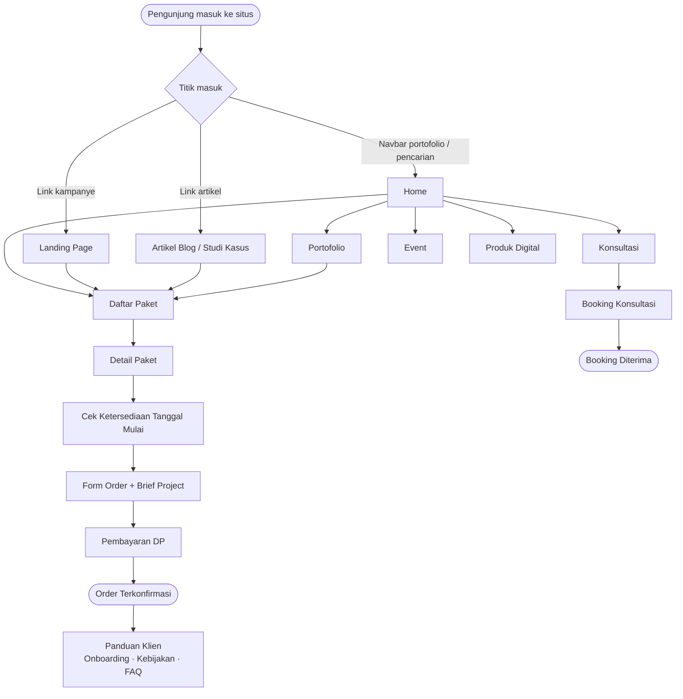
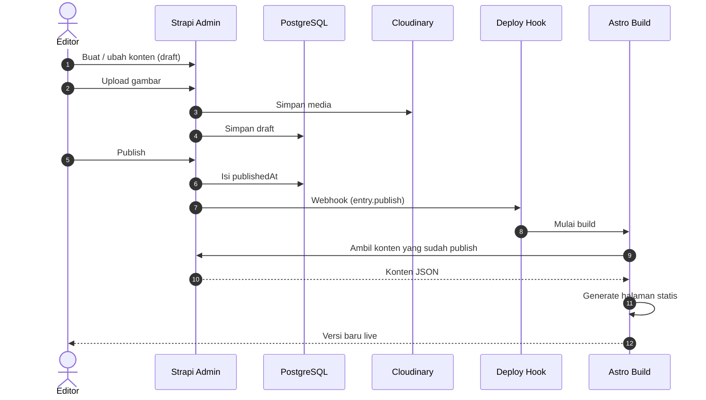
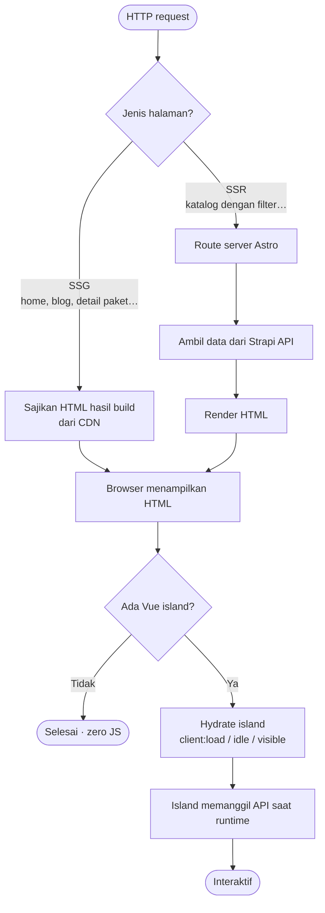
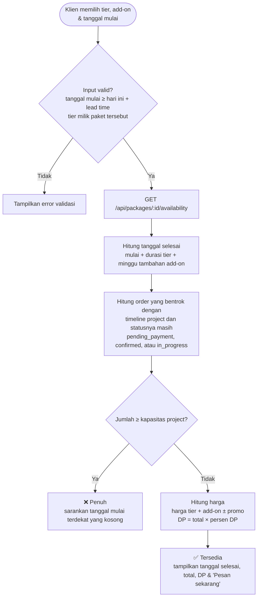
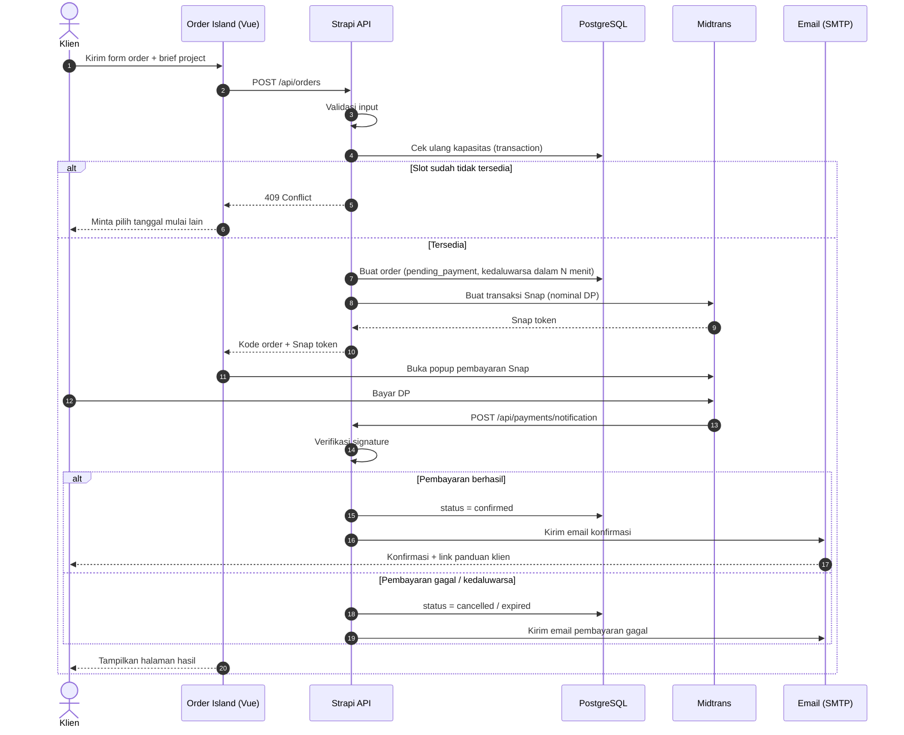
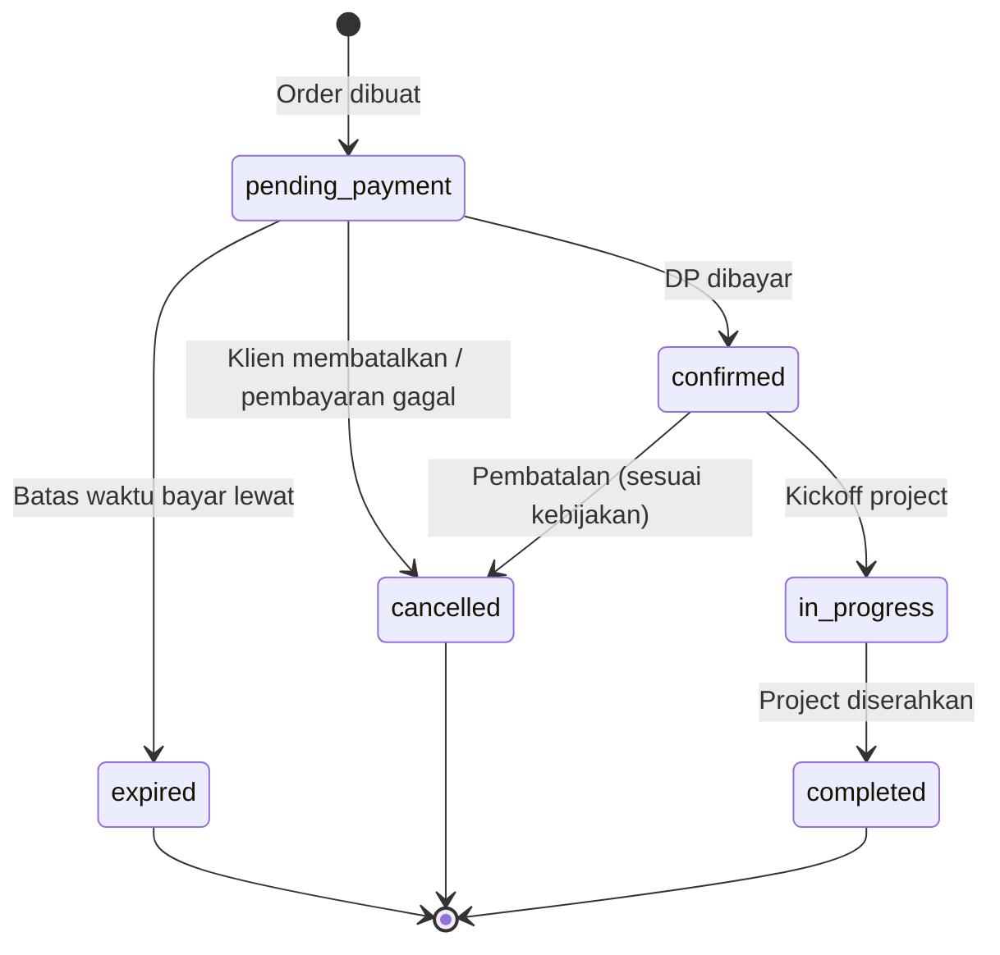
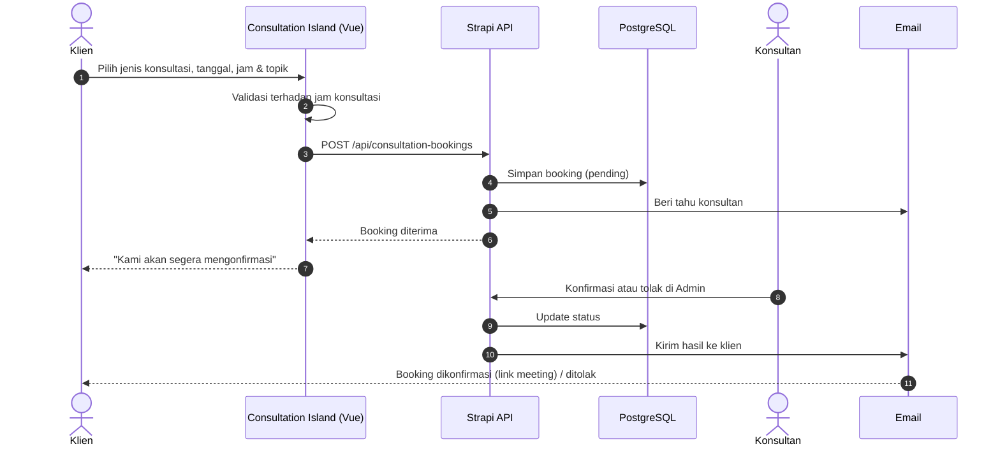
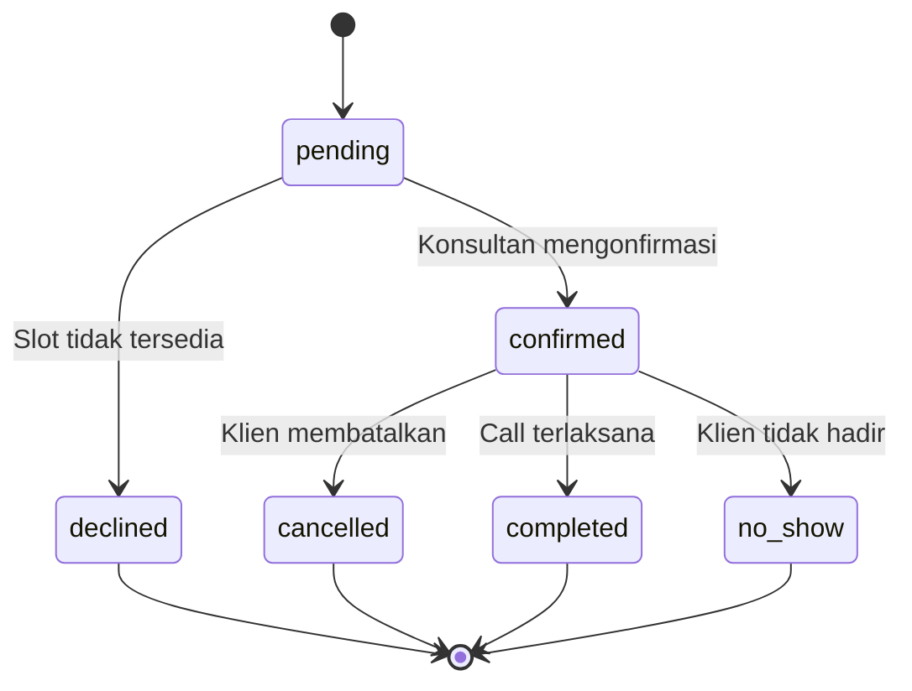
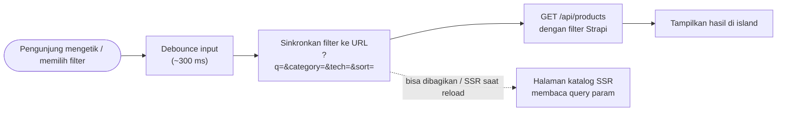

# 🔄 Alur

[← Kembali ke README](../../README.id.md) · [🇬🇧 English](../flows.md)

Halaman ini menjelaskan alur utama pengguna dan sistem di platform ini.

## Daftar Isi

1. [Perjalanan Pengunjung](#1-perjalanan-pengunjung)
2. [Publikasi Konten](#2-publikasi-konten)
3. [Request Halaman & Rendering](#3-request-halaman--rendering)
4. [Cek Ketersediaan Project](#4-cek-ketersediaan-project)
5. [Pemesanan Project & Pembayaran](#5-pemesanan-project--pembayaran)
6. [Siklus Status Order](#6-siklus-status-order)
7. [Booking Konsultasi](#7-booking-konsultasi)
8. [Pencarian & Filter Produk](#8-pencarian--filter-produk)
9. [Notifikasi Email](#9-notifikasi-email)

---

## 1. Perjalanan Pengunjung

Bagaimana calon klien bergerak di dalam website.



---

## 2. Publikasi Konten

Editor mengelola konten di Strapi. Saat konten di-publish, situs di-rebuild supaya halaman statis selalu terbaru.



> [!TIP]
> Data yang harus selalu live, seperti slot project dan harga saat order, **tidak pernah** diambil dari hasil build statis. Data ini selalu diambil saat runtime.

---

## 3. Request Halaman & Rendering

Cara sebuah request dilayani tergantung jenis halamannya.



---

## 4. Cek Ketersediaan Project

Berjalan di dalam **Vue island** ketersediaan pada halaman detail paket. Tim hanya bisa mengerjakan sejumlah project dalam waktu bersamaan, jadi sebuah tanggal mulai baru tersedia kalau masih ada kapasitas kosong di sepanjang timeline project.



**Aturan kapasitas.** Sebuah order yang sudah ada memakai satu slot di timeline yang diminta jika:

```text
existing.start_date  <  requested.end_date
AND
existing.end_date    >  requested.start_date
AND
existing.status IN ('pending_payment', 'confirmed', 'in_progress')
```

Tanggal mulai tersedia jika `COUNT(order yang bentrok) < SiteSetting.project_capacity`.

---

## 5. Pemesanan Project & Pembayaran



**Aturan penting**

- Kapasitas dicek **dua kali**: sekali untuk ditampilkan, dan sekali lagi di dalam transaksi DB saat order dibuat. Ini mencegah tim menerima project melebihi kapasitas.
- Order yang masih pending akan **kedaluwarsa** jika DP tidak dibayar dalam batas waktu pembayaran, sehingga slotnya kosong lagi.
- Harga dan DP selalu **dihitung di server**. Harga yang dikirim dari klien tidak pernah dipercaya.
- Webhook pembayaran **diverifikasi signature-nya** sebelum status order diubah.
- Sisa pembayaran ditagihkan saat serah terima. Pelunasan secara online masuk ke [pengembangan ke depan](../../README.id.md#-roadmap).

---

## 6. Siklus Status Order



| Status | Memakai kapasitas? | Keterangan |
| --- | --- | --- |
| `pending_payment` | ✅ | Menunggu DP dalam batas waktu pembayaran |
| `confirmed` | ✅ | DP sudah dibayar, menunggu kickoff |
| `in_progress` | ✅ | Project sedang dikerjakan |
| `completed` | ❌ | Project sudah diserahkan |
| `cancelled` | ❌ | Dibatalkan oleh klien, admin, atau karena pembayaran gagal |
| `expired` | ❌ | DP tidak dibayar tepat waktu |

---

## 7. Booking Konsultasi

Konsultasi tidak memerlukan pembayaran online. Konsultan mengonfirmasi booking dari admin Strapi lalu mengirim link meeting.





---

## 8. Pencarian & Filter Produk



Filter disimpan di URL, jadi hasil filter bisa dibagikan, di-bookmark, dan diindeks mesin pencari.

---

## 9. Notifikasi Email

Dikirim dari lifecycle hook atau controller Strapi melalui SMTP / Nodemailer.

| Pemicu | Penerima | Email |
| --- | --- | --- |
| Order dibuat | Klien | Order diterima + instruksi pembayaran DP |
| Pembayaran berhasil | Klien | Konfirmasi order + link panduan klien |
| Pembayaran berhasil | Admin | Ada order baru yang terkonfirmasi |
| Pembayaran gagal / kedaluwarsa | Klien | Pembayaran gagal / order kedaluwarsa |
| Order dibatalkan | Klien & Admin | Pemberitahuan pembatalan |
| Booking konsultasi dibuat | Konsultan | Ada booking konsultasi baru |
| Konsultasi dikonfirmasi / ditolak | Klien | Hasil booking + link meeting |
| H-1 sebelum kickoff | Klien | Pengingat kickoff + checklist persiapan *(ke depan)* |
